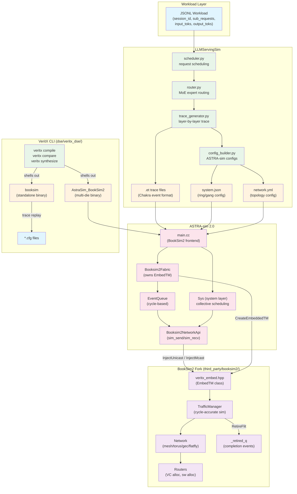
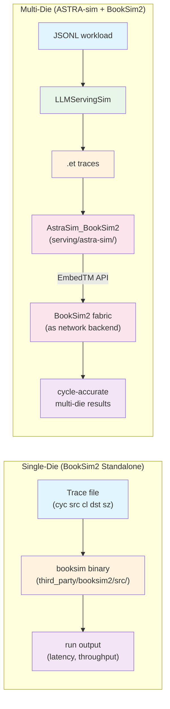
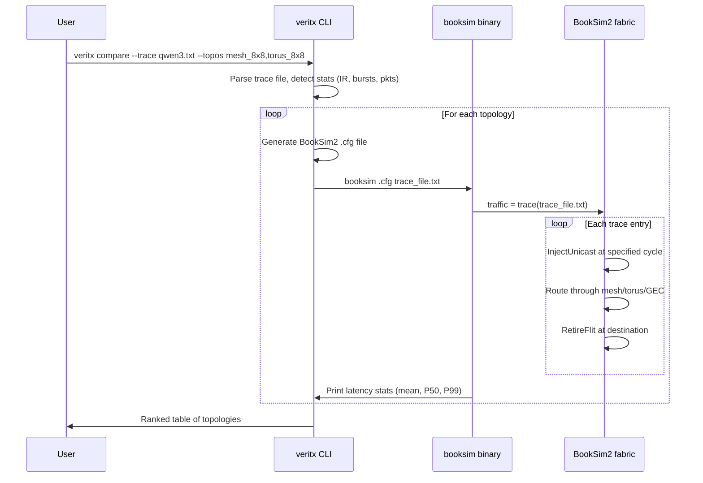
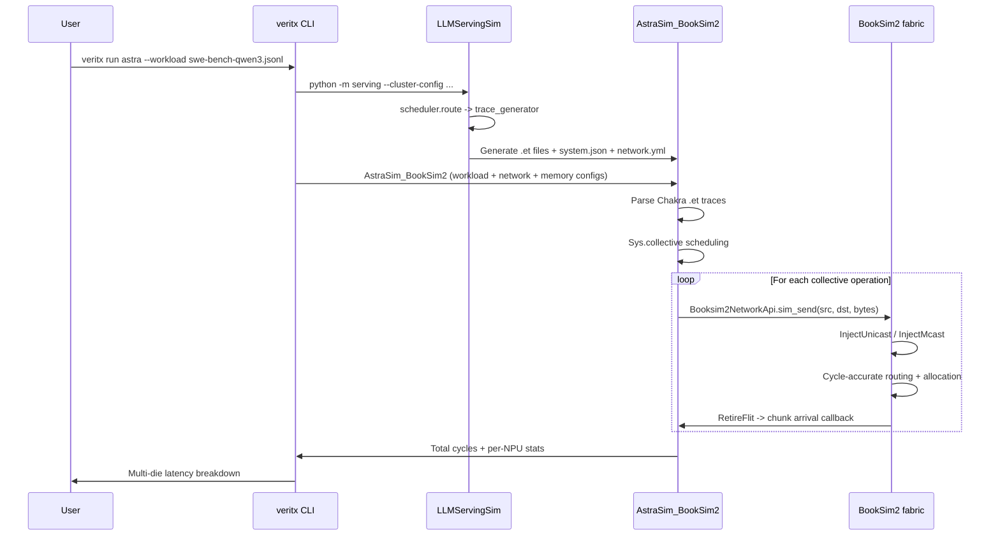
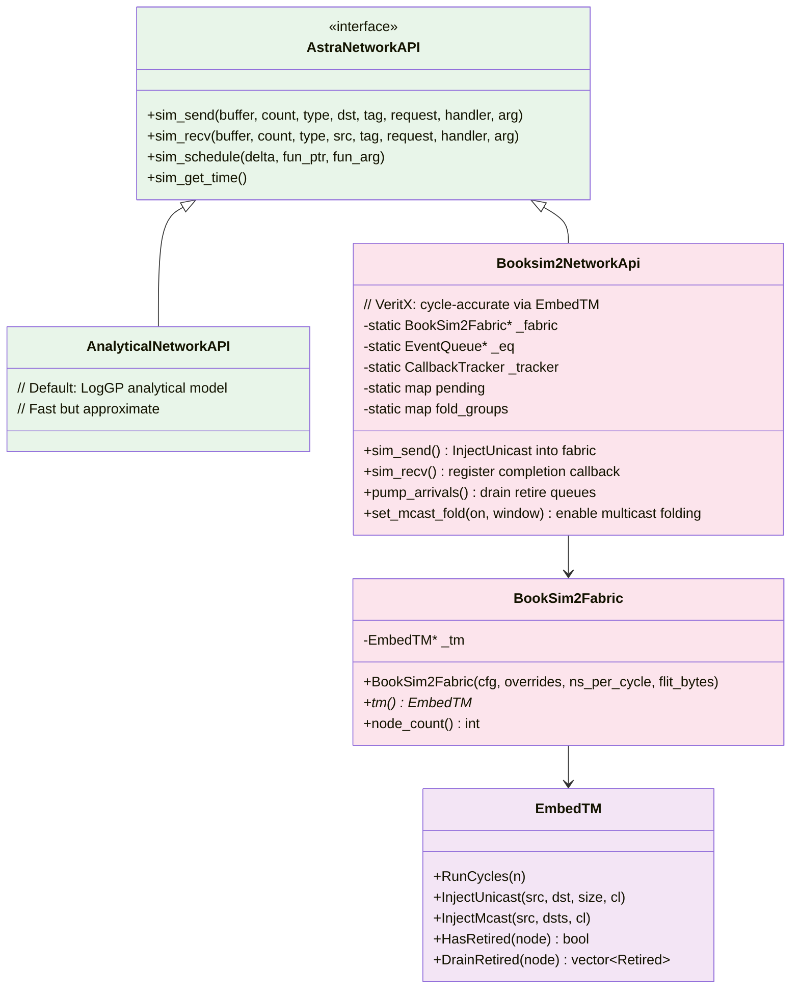

# serving/ -- Multi-Die Simulation & Trace Generation Stack

This directory contains the vendored third-party tools that power the multi-die
simulation leg of the VeritX research pipeline. Three components live here:

| Component | Role | Language | Size |
|-----------|------|----------|------|
| **ASTRA-sim 2.0** | System-level multi-die simulator | C++ | ~800 src files |
| **LLMServingSim** | LLM workload traffic trace generator | Python | ~20 src files |
| **results/** | Published 3-way comparison evidence | JSON | 9 files |

The canonical **BookSim2** NoC simulator (the fabric engine) lives at
`third_party/booksim2/`, not here. ASTRA-sim carries its own copy of the
BookSim2 fork source at `serving/astra-sim/extern/network_backend/booksim2/booksim2/src/`,
kept in sync by `python3 scripts/tools.py booksim2 sync`.

---

## Architecture Overview

The system has two simulation paths: **single-die** (BookSim2 standalone) and
**multi-die** (ASTRA-sim driving BookSim2 as its network backend).



### Single-Die vs Multi-Die Path



---

## File Layout

```
serving/
├── README.md                          # This file
├── .gitignore                         # Build artifact patterns
│
├── astra-sim/                         # ASTRA-sim 2.0 engine
│   ├── astra-sim/                     # Engine core
│   │   ├── common/                    # AstraNetworkAPI, AstraComputeAPI, Logging
│   │   ├── system/                    # Sys, streams, collective plans, CSV writer
│   │   ├── network_frontend/          # Pluggable network backends
│   │   │   ├── analytical/            # Default: LogGP analytical model
│   │   │   ├── booksim2/             # VeritX: BookSim2 cycle-accurate backend
│   │   │   │   ├── main.cc           # Entry point (creates fabric + event queue)
│   │   │   │   ├── Booksim2NetworkApi.cc  # sim_send/sim_recv via EmbedTM
│   │   │   │   ├── include/          # Booksim2NetworkApi.hh, Booksim2Tracker
│   │   │   │   └── examples/         # 4npus_snake.cfg (2x2 mesh config)
│   │   │   ├── htsim/                # HTSim network frontend
│   │   │   └── ns3/                  # ns-3 network frontend
│   │   └── bin/                       # Built binaries go here
│   │       └── chakra_to_et          # Chakra trace converter
│   ├── extern/                        # Vendored dependencies
│   │   ├── graph_frontend/           # Chakra trace converter (protobuf-based)
│   │   ├── helper/                   # fmt, spdlog, json, cxxopts
│   │   ├── network_backend/booksim2/ # BookSim2 fabric wrapper
│   │   │   ├── Booksim2Fabric.cc/hh # Owns ONE shared EmbedTM instance
│   │   │   ├── CMakeLists.txt       # Builds static lib from third_party/booksim2 source
│   │   │   └── booksim2/src/        # COPY of BookSim2 fork (synced from third_party/)
│   │   └── remote_memory_backend/   # Analytical remote memory
│   ├── build/astra_booksim2/        # CMake build system
│   │   └── CMakeLists.txt           # Orchestrates AstraSim + BookSim2Fabric + frontend
│   ├── examples/                     # Reference configs
│   │   ├── network/                  # analytical/, htsim/, ns3/ topologies
│   │   │   └── analytical/          # Ring_4npus.yml, HGX-H100-validated.yml
│   │   ├── system/                   # native_collectives/, custom_collectives/
│   │   └── workload/                 # microbenchmarks
│   ├── qwen_slice/                   # Pre-generated Qwen3 workload traces (.et)
│   ├── CMakeLists.txt               # Top-level CMake
│   └── README.md                     # Upstream ASTRA-sim docs
│
├── LLMServingSim/                     # Traffic trace generator (KAIST)
│   ├── serving/                       # Trace generation pipeline
│   │   ├── core/
│   │   │   ├── __main__.py           # Entry: python -m serving --cluster-config ...
│   │   │   ├── scheduler.py          # Request scheduling (prefill/decode interleaving)
│   │   │   ├── router.py             # MoE expert routing, gate functions
│   │   │   ├── trace_generator.py    # Layer-by-layer trace -> .et files
│   │   │   ├── config_builder.py     # Generates ASTRA-sim system/network/memory configs
│   │   │   ├── graph_generator.py    # Chakra computation graph generation
│   │   │   ├── memory_model.py       # Memory access pattern modeling
│   │   │   ├── power_model.py        # Power estimation from trace activity
│   │   │   ├── pim_model.py          # Processing-in-memory model
│   │   │   ├── radix_tree.py         # Prefix-tree for shared KV-cache
│   │   │   ├── gate_function.py      # MoE gate function simulation
│   │   │   ├── controller.py         # Iteration loop controller
│   │   │   ├── request.py            # Request data structures
│   │   │   ├── utils.py              # Shared utilities
│   │   │   ├── logger.py             # Logging configuration
│   │   │   └── run_paths.py          # Path resolution for runs
│   │   └── run.sh                    # Shell entry point
│   ├── profiler/                      # Hardware latency measurement
│   │   ├── core/
│   │   │   ├── engine.py             # Profiling engine (torch hooks on GPU)
│   │   │   ├── categories.py         # Layer categories (attention, MLP, etc.)
│   │   │   ├── hooks/                # Batch, timing, MoE hooks
│   │   │   ├── runner.py             # Runs profiling jobs
│   │   │   └── writer.py             # Writes measured latencies to DB
│   │   └── models/                   # Model configs (qwen3_moe.yaml, llama.yaml, etc.)
│   ├── traces/run_1786643546936153_195056/  # THE CITED RUN
│   │   ├── trace/                    # .et trace files + event_handler.txt
│   │   ├── network/network.yml       # Generated network config
│   │   ├── system/system.json        # Generated system config
│   │   └── memory/memory_expansion.json
│   ├── workloads/                    # Input workload definitions (JSONL)
│   │   ├── swe-bench-qwen3-30b-a3b-50-sps0.2.jsonl  # Qwen3-30B-A3B workload
│   │   ├── example_trace.jsonl       # Minimal example
│   │   └── generators/               # Workload generation scripts
│   ├── configs/                      # Cluster/model configurations
│   ├── astra-sim/                    # ASTRA-sim config templates
│   └── README.md                     # Upstream LLMServingSim docs
│
└── results/                           # Published evidence
    ├── serving_level_headroom.json    # Bridge fork vs source: 3.4x headroom
    ├── fork_vs_source_trace_mix.json  # Fork-vs-source latency win: 15-21%
    ├── fork_vs_source_col0.json       # Column-0 fork analysis
    ├── trace_matrix_128x128.mat       # 128x128 trace matrix
    ├── moe_trace_matrix.json          # MoE-specific trace matrix
    ├── trace_bridge_saturation.json   # Bridge saturation analysis
    ├── smallcell_d3_ab_fix.json       # Small cell D3 findings
    ├── bigcell_d3_findings.json       # Big cell D3 findings
    └── ab_only_fix4.json             # A/B test results
```

---

## How VeritX CLI Connects to These Tools

The VeritX CLI (at `tracks/t3-topology/dse/veritx_dse/`) discovers these tools
through path constants defined in `paths.py`:

```python
# veritx_dse/paths.py
BOOKSIM_DIR  = REPO / "third_party" / "booksim2" / "src"
BOOKSIM_BIN  = BOOKSIM_DIR / "booksim"              # standalone binary
ASTRA_DIR    = REPO / "serving" / "astra-sim"
ASTRA_BS_BIN = ASTRA_DIR / "astra-sim" / "network_frontend" / "booksim2" / "bin" / "AstraSim_BookSim2"
LLMSIM_DIR   = REPO / "serving" / "LLMServingSim"
CHAKRA_TO_ET = ASTRA_DIR / "astra-sim" / "bin" / "chakra_to_et"
```

The CLI uses two distinct simulation modes:

| CLI Command | Backend | What It Does |
|-------------|---------|--------------|
| `veritx compare` | `booksim` standalone | Runs trace replay on a single NoC fabric (mesh, torus, GEC, etc.) |
| `veritx compile` | `booksim` standalone | Full 6-stage pipeline (validate, simulate, optimize, verify, generate) |
| `veritx run astra` | `AstraSim_BookSim2` | Multi-die simulation with ASTRA-sim driving the BookSim2 fabric |

---

## The BookSim2 Fork: Two APIs

The BookSim2 fork at `third_party/booksim2/` provides two distinct APIs,
each serving a different simulation path:

### 1. Trace Replay API (`veritx_ext.hpp`)

Used by the **standalone** `booksim` binary. Reads a trace file of
`{cycle, src, class, dst, size}` entries and injects packets at the
specified cycle. Registered as a custom traffic pattern in BookSim2's
factory:

```
traffic = trace(path/to/trace.txt)
```

This is what `veritx compare` and `veritx compile` use for single-die
topology evaluation. The trace format is a simple 5-column text file
generated from real LLM serving traces.

### 2. Embedding API (`veritx_embed.hpp`)

Used by the **ASTRA-sim** integration. Exposes `EmbedTM` -- a
`TrafficManager` subclass that:
- Steps in caller-controlled chunks (`RunCycles(n)`)
- Accepts externally injected packets (`InjectUnicast`, `InjectMcast`)
- Reports completions via retire queues (`HasRetired`, `DrainRetired`)

This is what `AstraSim_BookSim2` uses. ASTRA-sim's system layer calls
`sim_send`/`sim_recv` which map to `InjectUnicast`/`InjectMcast` on the
shared fabric.

```cpp
// EmbedTM: the bridge between ASTRA-sim and BookSim2
class EmbedTM : public TrafficManager {
    void RunCycles(int cycles);           // advance fabric by N cycles
    void InjectUnicast(src, dst, sz, cl); // inject one packet
    void InjectMcast(src, dsts, cl);      // inject multicast stream
    bool HasRetired(int node);            // check for completions
    vector<Retired> DrainRetired(int node); // drain completions
};
```

---

## Data Flow: From Workload to Cycle Count

### Single-Die Path (veritx compare/compile)



### Multi-Die Path (veritx run astra)



---

## Rebuilding ASTRA-sim

The ASTRA-sim BookSim2 binary requires protobuf and a C++17 compiler:

```bash
# From repo root
cd serving/astra-sim/build/astra_booksim2

# Point CMake to the canonical BookSim2 source
BOOKSIM2_SRC_DIR=$(realpath ../../../third_party/booksim2) cmake .

# Build (takes ~2 minutes)
cmake --build . -j$(nproc)

# Binary appears at:
# serving/astra-sim/astra-sim/network_frontend/booksim2/bin/AstraSim_BookSim2
```

**Dependencies:** protobuf 3.21.12+ (for Chakra trace parsing in
`extern/graph_frontend/`).

If you only need the standalone `booksim` binary (for `veritx compare`/`compile`),
build from `third_party/booksim2/src/` instead:

```bash
cd third_party/booksim2/src
make clean && make -j$(nproc)
# Binary: third_party/booksim2/src/booksim
```

---

## Syncing BookSim2 Source Between Copies

Two copies of the BookSim2 fork exist in the repo:

| Location | Purpose |
|----------|---------|
| `third_party/booksim2/src/` | **Canonical** source. Edit here. |
| `serving/astra-sim/extern/network_backend/booksim2/booksim2/src/` | ASTRA-sim's copy. Auto-synced. |

All tool management goes through `scripts/tools.py` (auto-discovers tools
from `METADATA.json`). After editing any file in `third_party/booksim2/src/`:

```bash
# Sync canonical -> ASTRA-sim copy
python3 scripts/tools.py booksim2 sync

# Verify only (dry run)
python3 scripts/tools.py booksim2 sync --check

# Or via Makefile
make tool-sync TOOL=booksim2

# Then rebuild both targets:
cd third_party/booksim2/src && make -j$(nproc)          # standalone
cd serving/astra-sim/extern/network_backend/booksim2/build && make -j$(nproc)  # library
```

The sync copies `*.cpp`, `*.hpp`, `*.h`, `*.c`, and `Makefile` but
skips compiled binaries (`booksim`, `libveritx_embed.a`).

Sync targets are declared in `METADATA.json` under `sync_targets`, not
hardcoded in shell scripts. To add a new sync destination, edit the tool's
`METADATA.json`.

---

## How LLMServingSim Generates Traces

LLMServingSim models the full LLM serving pipeline and generates per-layer
communication traces that ASTRA-sim can consume.

### Input: JSONL Workload

Each line describes one serving session:

```json
{
  "session_id": "astropy__astropy-12907-run0",
  "arrival_time_ns": 4059740,
  "sub_requests": [{
    "input_toks": 1472,
    "output_toks": 133,
    "tool_duration_ns": 0,
    "input_tok_ids": [...],
    "output_tok_ids": [...]
  }]
}
```

### Pipeline Stages

1. **Scheduler** (`scheduler.py`) -- Interleaves prefill and decode requests
   across the serving batch. Determines which layers execute when.

2. **Router** (`router.py`) -- Simulates MoE expert routing. Decides which
   experts each token is dispatched to (top-k selection).

3. **Trace Generator** (`trace_generator.py`) -- For each layer execution,
   computes communication volumes (all-gather, all-reduce, reduce-scatter,
   all-to-all) and writes Chakra `.et` trace files.

4. **Config Builder** (`config_builder.py`) -- Generates ASTRA-sim config
   files: `system.json` (ring/gang collective implementation),
   `network.yml` (topology), `memory_expansion.json`.

### Output: .et Trace Files

One `.et` file per NPU, containing timestamped events:

```
EVENT
1
Layername     comp_time  input_loc  input_size  weight_loc  weight_size  output_loc  output_size  comm_type  comm_size  misc
attn_qkv      2840       REMOTE     12582912    LOCAL        4194304      REMOTE       12582912     ALLGATHER  12582912   NONE
```

### Hardware Latency Profiles

The `profiler/` directory contains measured per-layer latencies from actual
GPU runs (RTXPRO6000 with torch hooks). Model configs are in `profiler/models/`:

- `qwen3_moe.yaml` -- Qwen3-30B-A3B (128 experts, top-8)
- `llama.yaml` -- LLaMA variants
- `mixtral.yaml` -- Mixtral 8x7B
- `phimoe.yaml` -- PhiMoE

---

## Building ASTRA-sim from Scratch

### Prerequisites

```bash
# Ubuntu/Debian
sudo apt-get install cmake g++ protobuf-compiler libprotobuf-dev

# macOS
brew install cmake protobuf
```

### Build Steps

```bash
# 1. Build BookSim2 standalone (for veritx compare/compile)
cd third_party/booksim2/src
make -j$(nproc)

# 2. Build ASTRA-sim BookSim2 binary (for multi-die simulation)
cd serving/astra-sim/build/astra_booksim2
BOOKSIM2_SRC_DIR=$(realpath ../../../third_party/booksim2) cmake .
cmake --build . -j$(nproc)

# 3. Build Chakra trace converter (optional, for .et conversion)
cd serving/astra-sim
cmake --build build -j$(nproc) --target chakra_to_et
```

---

## Running Simulations

### Single-Die: Topology Comparison

```bash
# Compare mesh vs torus on real Qwen3 trace
veritx compare \
  --trace runs/traces/qwen3_trace.txt \
  --topos mesh_8x8,torus_8x8,gec_k8_o7d1,flatfly_64

# With statistical confidence (multiple seeds)
veritx compare \
  --trace runs/traces/qwen3_trace.txt \
  --topos mesh_8x8,torus_8x8 \
  --seeds 3

# Throughput mode (Bernoulli injection, sweep IR)
veritx compare --mode throughput --ir 0.05 \
  --topos mesh_8x8,torus_8x8
```

### Multi-Die: ASTRA-sim + BookSim2

```bash
# Run with pre-generated Qwen3 workload
veritx run astra \
  --ets serving/astra-sim/qwen_slice/qwen_slice \
  --system-config serving/astra-sim/examples/system/native_collectives/Ring_4chunks.json \
  --network-config serving/astra-sim/astra-sim/network_frontend/booksim2/examples/4npus_snake.cfg \
  --memory-config serving/astra-sim/examples/remote_memory/analytical/no_memory_expansion.json

# Or directly invoke the binary
serving/astra-sim/astra-sim/network_frontend/booksim2/bin/AstraSim_BookSim2 \
  --workload-configuration serving/astra-sim/qwen_slice/qwen_slice \
  --system-configuration serving/astra-sim/examples/system/native_collectives/Ring_4chunks.json \
  --network-configuration serving/astra-sim/astra-sim/network_frontend/booksim2/examples/4npus_snake.cfg \
  --remote-memory-configuration serving/astra-sim/examples/remote_memory/analytical/no_memory_expansion.json \
  --logging-configuration empty \
  --logging-folder /tmp/astra_run \
  --booksim2-extra="injection_rate=0.0"
```

### Generating Traces from Workloads

```bash
# Generate traces from a JSONL workload
cd serving/LLMServingSim
python -m serving \
  --cluster-config configs/<model>.yaml \
  --workload ../workloads/swe-bench-qwen3-30b-a3b-50-sps0.2.jsonl
```

---

## Extending with a New Third-Party Tool

To add a new tool (e.g., a different network simulator or a new trace generator):

### Decision: `third_party/` vs `serving/`

| | `third_party/` | `serving/` |
|---|---|---|
| **Use when** | You modify the tool's source | You vendor it unmodified |
| **Example** | BookSim2 (trace replay, embed API) | ASTRA-sim, LLMServingSim |
| **Edit source?** | Yes (canonical copy) | No (upstream stays pristine) |
| **Sync needed?** | Only if it appears elsewhere | N/A |

### Steps

1. **Vendor the source:**
   ```bash
   # For tools you modify:
   mkdir -p third_party/<tool>/src
   cp -r <upstream-src>/* third_party/<tool>/src/

   # For tools you don't modify:
   mkdir -p serving/<tool>
   cp -r <upstream-src>/* serving/<tool>/
   ```

2. **Create METADATA.json** (recommended):
   ```json
   {
     "name": "<tool>",
     "description": "Brief description",
     "upstream": "<repo URL>",
     "commit": "<vendored commit hash>",
     "date_vendored": "YYYY-MM-DD",
     "patches": ["list of local changes"],
     "build_command": "cd src && make -j$(nproc)",
     "used_by": ["t3-topology"]
   }
   ```

3. **Add build scripts** (if C/C++):
   ```bash
   # For tools you modify:
   cat > third_party/<tool>/src/Makefile << 'EOF'
   CXX = g++
   CXXFLAGS = -std=c++17 -O2 -Wall
   SRCS = $(wildcard *.cpp)
   all: <binary>
   <binary>: $(SRCS)
       $(CXX) $(CXXFLAGS) -o $@ $^
   EOF
   ```

4. **Wire into paths.py** (if CLI uses it):
   ```python
   # veritx_dse/paths.py
   NEW_TOOL_DIR = REPO / "third_party" / "<tool>" / "src"
   NEW_TOOL_BIN = NEW_TOOL_DIR / "<binary>"
   ```

5. **Add .gitignore patterns** (for build artifacts):
   ```gitignore
   # In serving/.gitignore or third_party/<tool>/.gitignore
   **/build/
   **/*.o
   **/*.a
   ```

6. **Document the tool** in this README under the file layout section.

### Sync Pattern (if tool appears in multiple places)

If the same source needs to exist in two locations (like BookSim2 in
`third_party/` and `serving/astra-sim/`):

```bash
# Create sync script
cat > third_party/<tool>/sync_to_<dest>.sh << 'SCRIPT'
#!/bin/bash
set -euo pipefail
SRC="$(cd "$(dirname "$0")/src" && pwd)"
DST="<destination>/src"
rsync -av --delete --exclude='*.o' --exclude='<binary>' "$SRC/" "$DST/"
echo "Synced $SRC -> $DST"
SCRIPT
chmod +x third_party/<tool>/sync_to_<dest>.sh
```

---

## ASTRA-sim Network Frontend Architecture

ASTRA-sim supports multiple network backends via the `AstraNetworkAPI`
interface. The VeritX integration adds a BookSim2 backend:



### Multicast Folding

When enabled (`--booksim2-mcast-fold=true`), the Booksim2NetworkApi
detects consecutive `sim_send` calls from one source with the same byte
count to different destinations within a configurable window, and folds
them into a single multicast injection on the fabric. This models the
MoE expert-dispatch pattern where one activation is fanned out to k
experts.

---

## Config File Formats

### BookSim2 Network Config (.cfg)

```ini
topology = mesh
k = 4                     # radix (nodes per row)
n = 4                     # dimension count
routing_function = adaptive
num_vcs = 4
vc_buf_size = 8
wait_for_tail_credit = 1
vc_allocator = islip
sw_allocator = islip
alloc_iters = 1
credit_delay = 2
packet_size = 4           # flits per packet
sim_type = latency
injection_rate = 0.0      # 0 for trace-driven mode
```

### ASTRA-sim System Config (system.json)

```json
{
  "scheduling_policy": "LIFO",
  "total䎭ompute_nodes": 4,
  "preferredchni_scale": "1.0",
  "all-reduce-implementation": ["ring"],
  "all-gather-implementation": ["ring"],
  "reduce-scatter-implementation": ["ring"],
  "all-to-all-implementation": ["ring"]
}
```

### ASTRA-sim Network Config (network.yml)

```yaml
name: 4NPUs
topology:
  ifname: eth0
  bandwidth: 50          # GB/s
  latency: 0.5           # microseconds
  packet_size: 4096      # bytes
  dimensions: [0]
  nodes_per_dim: [4]
  link_latency: [0.5]
  link_bandwidth: [50.0]
```

### LLMServingSim Workload Format (JSONL)

```json
{
  "session_id": "unique-session-id",
  "arrival_time_ns": 4059740,
  "sub_requests": [
    {
      "input_toks": 1472,
      "output_toks": 133,
      "tool_duration_ns": 0,
      "input_tok_ids": [151644, 8948, ...],
      "output_tok_ids": []
    }
  ]
}
```

---

## Pinned Versions

| Component | Source | Commit | Date Vendored |
|-----------|--------|--------|---------------|
| ASTRA-sim | github.com/ASTRA-Sim/ASTRA-sim | 518bd51 ("update ns3 submodule #366") | 2026-08-17 |
| LLMServingSim | github.com/KAIST-AILab/LLMServingSim | 2c2042c ("Merge pull request #57") | 2026-08-17 |
| BookSim2 fork | third_party/booksim2/ (see METADATA.json) | 28f4329 (updated-booksim branch) | 2026-08-25 |

---

## Recovery

If the cleanup removed something you need:

```bash
# Restore pre-cleanup state
git checkout backup-pre-serving-cleanup -- serving/

# Or restore specific files
git checkout backup-pre-serving-cleanup -- serving/booksim2-embed/
```

---

## Troubleshooting

### "ASTRA-sim BookSim2 binary not found"

Build it:
```bash
cd serving/astra-sim/build/astra_booksim2
BOOKSIM2_SRC_DIR=$(realpath ../../../third_party/booksim2) cmake .
cmake --build . -j$(nproc)
```

### "protobuf version mismatch"

ASTRA-sim requires protobuf 3.21.12+ for Chakra trace parsing. Check:
```bash
protoc --version  # Should be 3.21.12 or newer
```

### BookSim2 binary crashes with "trace file not found"

Ensure you're using the `traffic = trace(path)` syntax and the path is
absolute or relative to the working directory:
```
traffic = trace(/absolute/path/to/trace.txt)
```

### ASTRA-sim timeout on large traces

Large traces (1M+ packets) can take 5-10 minutes. Use `--timeout 600`:
```bash
veritx run astra --ets ... --timeout 600
```

### "BookSim2 source out of sync"

After editing BookSim2 source, run:
```bash
python3 scripts/tools.py booksim2 sync --check
```
If differences are found, run without `--check` to sync.
