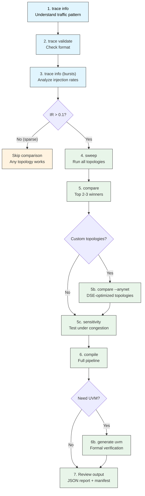

## 3a. Step-by-Step Tutorial: Complete DSE Workflow

This tutorial walks through the entire design space exploration workflow, from understanding your traffic trace to selecting the best topology and compiling a verified fabric.

### Overview

```mermaid
flowchart LR
    A["Step 1\nUnderstand Trace"] --> B["Step 2\nValidate Format"]
    B --> C["Step 3\nAnalyze Bursts"]
    C --> D["Step 4\nSweep Topologies"]
    D --> E["Step 5\nCompare Winners"]
    E --> F["Step 6\nCompile Fabric"]
    F --> G["Step 7\nVerify + Report"]

    style A fill:#e1f5fe,stroke:#333
    style B fill:#e8f5e9,stroke:#333
    style C fill:#e8f5e9,stroke:#333
    style D fill:#e8f5e9,stroke:#333
    style E fill:#e8f5e9,stroke:#333
    style F fill:#e8f5e9,stroke:#333
    style G fill:#e8f5e9,stroke:#333


    classDef input fill:#e1f5fe,stroke:#01579b,color:#000
    classDef cli fill:#e8f5e9,stroke:#2e7d32,color:#000
    classDef sim fill:#fff3e0,stroke:#e65100,color:#000
    classDef api fill:#fce4ec,stroke:#c62828,color:#000
    classDef output fill:#f3e5f5,stroke:#6a1b9a,color:#000
    class A input
```



### Step 1: Understand Your Traffic Trace

Before running any simulation, understand what your trace represents.

```bash
veritx trace info runs/traces/qwen3_serving_16rank.trace
```

Expected output:
```
Size:         1,531,093 bytes (1495KB)
Packets:      95,232
Sources:      16
Classes:      2
Time range:   [0, 652210] (652,211 cycles)
Avg IR:       0.146014 pkts/cycle
Bursts:       48 (gap>100c)
Avg burst:    1984 pkts
Max burst:    1984 pkts
Avg gap:      12773 cycles
Top srcs:     [(0, 49152), (4, 3072), (8, 3072), (12, 3072), (16, 3072)]
Top dsts:     [(4, 6144), (8, 6144), (12, 6144), (16, 6144), (20, 6144)]
Profile:      MODERATE (0.1<IR<1.0) -- topology may matter
Burst IR:     1.94 pkts/cycle (during max burst)
Burst mode:   INJECTION-LIMITED -- NIC injection is bottleneck
```

**What to look for:**

| Metric | What it tells you | Action if concerning |
|--------|-------------------|---------------------|
| `Profile: MODERATE` | Topology matters (0.1 < IR < 1.0) | Run full comparison |
| `Profile: SPARSE` | Topology irrelevant (IR < 0.1) | Skip comparison, any topology works |
| `Profile: SATURATED` | Network is the bottleneck (IR > 1.0) | Focus on wire count, not latency |
| `Burst IR: 1.94` | 13x average during bursts | Topology matters most during bursts |
| `Top srcs: [(0, 49152)]` | Skewed: source 0 sends 51% of traffic | Check if topology handles skew |

### Step 2: Validate Trace Format

```bash
veritx trace validate runs/traces/qwen3_serving_16rank.trace
```

Expected output:
```
Format:       VALID
Packets:      95,232
Sources:      16 unique (IDs 0-8)
Classes:      2
Sizes:        [8]
Time range:   [2727, 652210] (649,484 cycles)
Avg IR:       0.146627 pkts/cycle
Self-loops:   0

Warnings (1):
  All packets have same size ({8}) -- unusual for real traffic

Trace is usable but has 1 warnings
```

**If validation fails:**
- `Path traversal not allowed` -- use absolute paths
- `File not found` -- check the path, use `ls` to verify
- `Invalid format` -- check trace file is ASCII, space-separated

### Step 3: Analyze Burst Patterns

Understanding bursts is critical because topology matters most during high-traffic periods.

```bash
veritx trace info runs/traces/qwen3_serving_16rank.trace 2>&1 | grep -A5 "Burst"
```

Key insight: This trace has **injection-limited bursts** -- the NIC can only inject so fast, so the network isn't saturated during bursts. This means topology differences will be small.

### Step 4: Sweep All Topologies

Run every built-in topology to find the baseline:

```bash
veritx sweep --trace runs/traces/qwen3_serving_16rank.trace --timeout 60
```

Expected output:
```
Topology         Nodes  Edges    Latency    Hops Status
------------------------------------------------------------
mesh_4x4            16     32    638.11c       -   OK
mesh_8x8            64    128   1863.12c       -   OK
torus_8x8           64    128   1891.04c       -   OK
flatfly_64          64     48   1951.18c       -   OK
gec_express_k8      64    560   1836.43c       -   OK
gec_mecs_k8         64    176   2257.16c       -   OK
gec_mesh_k8         64    112   1836.43c       -   OK

Best: mesh_4x4 (638.11c)
Worst: gec_mecs_k8 (2257.16c)
Spread: 71.7%
```

**Interpretation:**
- mesh_4x4 wins because it has fewer nodes (16 vs 64) -- not a fair comparison
- Among 64-node topologies: mesh_8x8 (1863c) is close to gec_express (1836c)
- torus is slightly worse than mesh (wrap-around links don't help here)
- gec_mecs is the worst -- multicast overhead hurts sparse traffic

### Step 5: Compare Top Winners Head-to-Head

Focus on the top contenders:

```bash
veritx compare \
    --trace runs/traces/qwen3_serving_16rank.trace \
    --topos mesh_8x8,torus_8x8 \
    --seeds 3 \
    --timeout 60
```

Expected output:
```
Topology         Nodes  Edges     Mean     Std      Min      Max Runs
------------------------------------------------------------------------
mesh_8x8            64    128 1863.12c   0.00c 1863.12c 1863.12c    3
torus_8x8           64    128 1891.04c   0.00c 1891.04c 1891.04c    3

Winner: mesh_8x8 (1863.12c +/- 0.00c)
vs torus_8x8: 1.5% faster
```

**Why 3 seeds?** BookSim is deterministic, but different seeds exercise different random arbitration decisions. 3 seeds give statistical confidence.

### Step 5b: Try Custom Topologies

If you have DSE-optimized topologies (from RHO/GRPO search):

```bash
veritx compare \
    --trace runs/traces/qwen3_serving_16rank.trace \
    --topos mesh_8x8,torus_8x8 \
    --anynet runs/booksim/grpo_best.anynet \
    --seeds 3
```

Expected output:
```
Topology         Nodes  Edges     Mean     Std      Min      Max Runs
------------------------------------------------------------------------
mesh_8x8            64    128 1863.12c   0.00c 1863.12c 1863.12c    3
torus_8x8           64    128 1891.04c   0.00c 1891.04c 1891.04c    3
grpo_best           64    111 1842.67c   0.00c 1842.67c 1842.67c    3

Winner: grpo_best (1842.67c +/- 0.00c)
vs torus_8x8: 2.6% faster
```

**Key finding:** grpo_best (111 edges) beats mesh (128 edges) by 2.6% with 17 fewer wires. Wire-efficient.

### Step 5c: Sensitivity Analysis

Test how rankings change under different injection rates:

```bash
veritx compare \
    --trace runs/traces/qwen3_serving_16rank.trace \
    --topos mesh_8x8,torus_8x8 \
    --sensitivity 0.01 0.05 0.1 0.2
```

This tells you: does the topology ranking flip under congestion? If mesh always wins, the choice is clear. If rankings change, you need to decide which injection rate your workload actually experiences.

### Step 6: Compile the Fabric

Once you've selected a topology, run the full compile pipeline:

```bash
veritx compile examples/qwen3_moe_16npu.json
```

Expected output:
```
Step 1/6: Validate       ok=True, vc_count=1
Step 2/6: Derive         routing=dim_order, VCs=1
Step 3/6: Simulate       Latency: 1850.64c (real BookSim)
Step 4/6: Verify         7/8 PASS (F7 QoS pending)
Step 5/6: Generate       manifest, rtl, report
Step 6/6: Report         area=0.272mm2, power=0.07W, fmax=1965MHz

Compile Result
--------------------------------------------------
Model:      Qwen3-30B-A3B
Topology:   mesh k=8
Routing:    dim_order (LOCKED)
VCs:        1
Latency:    1850.64c
Area:       0.2720 mm2
Power:      0.0701 W
Fmax:       1965 MHz
Energy:     0.600 pJ/bit
Verify:     7/8 PASS
Artifacts:  manifest, rtl, report
Manifest:   rev=1 signed=True
Hash:       7fbc43ab7e8a5d4d...
```

**What happened:**
1. **Validate** -- checked CompileRequest, no LOCKED fields in NocConfig
2. **Derive** -- no blocking cycles in dependency graph -> dim_order routing, 1 VC
3. **Simulate** -- ran BookSim2 on the real trace, got 1850.64c latency
4. **Verify** -- F1-F8 checks, 7/8 pass (F7 QoS isolation pending)
5. **Generate** -- created UVM testbench + signed design manifest
6. **Report** -- estimated area/power/timing with accuracy caveats

### Step 6b: Generate UVM Testbench

For formal verification:

```bash
veritx generate uvm \
    --request examples/qwen3_moe_16npu.json \
    --out runs/uvm/
```

Produces:
- `tb_noc.sv` -- top-level testbench
- `seq_lib.sv` -- stimulus sequences
- `assertions.sv` -- protocol checks
- `cov.sv` -- coverage model

### Step 6c: Compare with Different Workloads

Test if your topology choice holds across workloads:

```bash
# MoE workload
veritx compile examples/qwen3_moe_16npu.json

# Dense workload
veritx compile examples/llama70b_tp64.json

# Small workload
veritx compile examples/llama1b_tp64.json
```

Compare results:
```
Workload       Latency    Area      Power     Topology
----------------------------------------------------
Qwen3 MoE      1850c      0.27mm2   0.07W     mesh_8x8
LLaMA-70B      58515c     0.98mm2   0.25W     mesh_8x8
LLaMA-1B       573c       0.92mm2   0.24W     mesh_8x8
```

### Step 7: Review the Output

The JSON report from `veritx compile` contains everything:

```json
{
  "area": {"total_mm2": 0.272, "routers_mm2": 0.1, "links_mm2": 0.038},
  "power": {"dynamic_w": 0.060, "leakage_w": 0.010, "total_w": 0.070},
  "timing": {"max_freq_mhz": 1965, "critical_path_ps": 381.8},
  "energy": {"per_bit_pj": 0.630},
  "simulation": {"latency": 1850.64},
  "vc_assignment": {"routing_function": "dim_order", "vc_count": 1},
  "verification": {"ok": true, "checks": [...], "errors": []},
  "artifacts": [{"kind": "manifest", "uri": "...", "checksum": "..."}],
  "manifest": {"design_id": "...", "revision": 1, "signature": "..."}
}
```

### Complete Workflow Summary



### Tips for New Users

1. **Start with `trace info`** -- always understand your traffic before simulating
2. **Use `--seeds 3`** in compare -- single-seed results can be misleading
3. **Check burst IR** -- if burst IR is close to average IR, topology doesn't matter much
4. **Compare against torus** -- torus is the honest baseline (same wires, wrap-around)
5. **Run sensitivity** -- topology rankings can flip under different injection rates
6. **Read accuracy caveats** -- BookSim latency is trustworthy, area/power are relative
7. **Use absolute paths** -- relative paths can fail depending on CWD

---

<a name="full-build-guide"></a>
