# VeritX — Intent-to-Fabric Compiler for AI Network-on-Chip

```
 __     __        _ _  __  __
 \ \   / /__ _ __(_) |_\ \/ /
  \ \ / / _ \ '__| | __|\  /
   \ V /  __/ |  | | |_ /  \
    \_/ \___|_|  |_|\__/_/\_\
```

**v0.3.0** — Turn workload traces into verified NoC topologies with cycle-accurate proof, formal reports, and signed design manifests.

> **If you're stuck, this README is the single source of truth.** Every command, every build step, every debug trick is here. This is a wiki — search it, don't guess.

---

## Table of Contents

- [1. What VeritX Does](#what-veritx-does)
- [2. Repository Layout](#repository-layout)
- [3. Quick Start](#quick-start)
- [4. Full Build Guide](#full-build-guide)
- [5. Command Reference](#command-reference)
- [6. Trace Format & Generation](#trace-format-generation)
- [7. Architecture](#architecture)
- [8. Design Principles](#design-principles)
- [9. Third-Party Dependencies](#third-party-dependencies)
- [10. BookSim2 Deep Dive](#booksim2-deep-dive)
- [11. ASTRA-sim Multi-Die Simulation](#astra-sim-multi-die-simulation)
- [12. Full-Stack LLM Serving Simulation (`veritx serve`)](#full-stack-llm-serving-simulation-veritx-serve)
- [13. E1-E5 Data Model](#e1-e5-data-model)
- [14. CompileRequest Format](#compilerequest-format)
- [15. Compile Pipeline Stages](#compile-pipeline-stages)
- [16. VC Derivation Algorithm](#vc-derivation-algorithm)
- [17. Verification Properties (F1-F8)](#verification-properties-f1-f8)
- [18. Output Format & Accuracy Caveats](#output-format-accuracy-caveats)
- [19. Built-in Topologies](#built-in-topologies)
- [20. Built-in Workload Presets](#built-in-workload-presets)
- [21. Extending VeritX](#extending-veritx)
- [22. Adding a New Topology](#adding-a-new-topology)
- [23. Adding a New Workload Preset](#adding-a-new-workload-preset)
- [24. Adding a New Agent Kind](#adding-a-new-agent-kind)
- [25. Adding a New Dependency Kind](#adding-a-new-dependency-kind)
- [26. Adding a New Engine Stage](#adding-a-new-engine-stage)
- [27. Adding a New Report Type](#adding-a-new-report-type)
- [28. Adding a New CLI Command](#adding-a-new-cli-command)
- [29. Adding a New Verification Check](#adding-a-new-verification-check)
- [30. Integrating New Third-Party Tools](#integrating-new-third-party-tools)
- [31. Testing](#testing)
- [32. Debugging & Troubleshooting](#debugging-troubleshooting)
- [33. Common Pitfalls](#common-pitfalls)
- [34. Performance Benchmarks](#performance-benchmarks)
- [35. Research Findings](#research-findings)
- [36. Comparison with Other Tools](#comparison-with-other-tools)
- [37. Hardware Requirements](#hardware-requirements)
- [38. Environment Setup](#environment-setup)
- [39. CI/CD Integration](#cicd-integration)
- [40. Security Considerations](#security-considerations)
- [41. API Reference](#api-reference)
- [42. Configuration Reference](#configuration-reference)
- [43. Glossary](#glossary)
- [44. Changelog](#changelog)
- [45. Roadmap](#roadmap)
- [46. Known Limitations](#known-limitations)
- [47. FAQ](#faq)
- [48. License](#license)
- [49. Contributing](#contributing)
- [50. References](#references)
- [51. Support](#support)
---

<a name="what-veritx-does"></a>
## 1. What VeritX Does

VeritX is an **intent-to-fabric compiler** for AI Network-on-Chip design. It takes a high-level description of your AI workload (model type, parallelism, traffic trace) and produces a complete, verified NoC fabric specification.

### What you give it:
- A model description (Qwen3 MoE, LLaMA-70B dense, etc.)
- Parallelism configuration (TP, EP, DP degrees)
- A traffic trace (generated from real LLM serving)
- Requirements (latency ceiling, bandwidth floor)

### What it gives you:
1. **Validated** system configuration against guardrails
2. **Derived** LOCKED parameters (routing, VC structure) from dependency graphs
3. **Simulated** latency via BookSim2 cycle-accurate simulation
4. **Verified** F1-F8 formal properties (deadlock freedom, liveness, ordering)
5. **Generated** UVM testbenches, RTL tracking, and signed design manifests
6. **Reported** area/power/timing estimates with accuracy caveats

### High-Level Pipeline

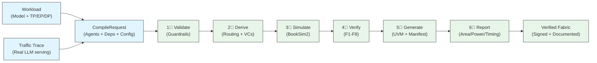

### Key insight:
The compiler doesn't just "run a simulation." It **derives** correctness-critical parameters (routing function, VC count, turn restrictions) from the dependency graph, so a user cannot accidentally create a deadlock-prone configuration.

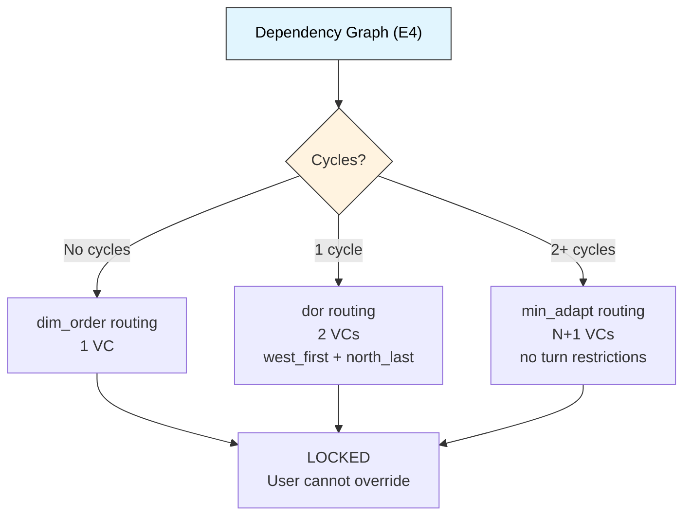

---

<a name="repository-layout"></a>
## 2. Repository Layout

```
veritx-research/                           repo root
  third_party/
    booksim2/                          CANONICAL BookSim2 fork (edit here)
      src/
        booksim                        CLI binary (standalone)
        libveritx_embed.a              embedding library (ASTRA-sim)
        veritx_embed.*                 embedding API (ASTRA-sim integration)
        veritx_ext.*                   trace replay extension
        traffic.cpp                    trace() traffic pattern factory
        flit.hpp/cpp                   multicast fields (mcast, mcast_copies)
        networks/
          anynet.o                     anynet topology support
          gec.o                        GEC express topology
          custom4.o                    MECS 4-tap topology
        Makefile                       builds booksim + libveritx_embed.a
        tools.py <tool> sync            sync to downstream copies (replaces sync_to_astra.sh)
      METADATA.json                    version tracking (v0.2.1)
    timeloop/                          Timeloop/Mapper (energy model)

  third_party/
    astra-sim/                         ASTRA-sim multi-die simulator
      astra-sim/network_frontend/booksim2/bin/
        AstraSim_BookSim2              multi-die binary
      extern/network_backend/booksim2/ internal booksim2 copy (synced)
      build/astra_booksim2/build.sh    booksim2-backend build script
      examples/network/ns3/            network configs (4/8/16 nodes)
    llmservingsim/                     LLMServingSim serving simulator
      serving/                         simulation frontend + trace generation
      profiler/                        measured module latencies
      traces/                          cited run traces + configs
      workloads/                       input workload JSONLs
    booksim2/                          vendored booksim source (source of truth)
    timeloop/                          Timeloop/Mapper (energy model)
    results/                           3-way comparison results

  runs/
    traces/                            traffic traces for simulation
      qwen3_serving_16rank.trace      Qwen3 MoE serving (95K pkts, 16 nodes)
      llama70b_tp64_ring.trace        LLaMA-70B ring (1.3M pkts, 64 nodes)
      llama70b_tp64_alltoall.trace    LLaMA-70B all-to-all (1.3M pkts)
      llama_1b_attention.trace         LLaMA-1B attention (258K pkts)
      qwen3_tree.trace                 Qwen3 tree topo (26M pkts)
      qwen3_star.trace                 Qwen3 star topo
      qwen3_ring.trace                 Qwen3 ring topo
    booksim/                           BookSim outputs + .anynet files
    compile_requests/                  generated CompileRequest JSONs

  scripts/
    golden_model.py                    golden model reference

  tracks/t3-topology/
    dse/                               VeritX CLI (this package)
      README.md                        THIS FILE (the wiki)
      pyproject.toml                   pip install -e . config

      veritx_dse/                      core package (30 modules)
        paths.py                       SINGLE SOURCE: REPO, DSE_DIR, RUNS_DIR, BOOKSIM_BIN
        cli.py                         17 CLI commands, thin dispatch
        compile_model.py               E1-E5 data model, guardrails, VC derivation
        pipeline.py                    compare, sweep, orchestration
        booksim.py                     BookSim2 config generation + execution
        evaluator.py                   BookSim runner with LRU caching
        traces.py                      trace validation + analysis
        reports.py                     area/power/timing estimates
        presets.py                     topology + workload registry
        artifact.py                    HMAC signing + manifests
        uvm_gen.py                     UVM testbench generator
        config.py                      configuration management (env vars)
        constants.py                   physical constants (7nm tech)
        errors.py                      structured error hierarchy
        logger.py                      file logger
        logging.py                     structured logging with Ctx
        recovery.py                    atomic writes + cleanup on failure
        commands_trace.py              trace CLI handlers (validate, info, extract)
        model_to_trace.py              traffic model to trace converter
        trace_to_binary.py             ASCII to binary trace conversion
        chakra_to_dse.py               Chakra trace converter
        recommend.py                   BO recommendation engine
        roofline.py                    roofline model analysis
        objective.py                   optimization objectives
        phase_sequencer.py             phase sequencing
        traffic_model.py               phase-aware traffic model
        dse_to_frontend.py             DSE-to-frontend interface
        __init__.py                    public API re-exports

      tests/                           278 tests (21 integration + 257 unit)
        test_integration.py            end-to-end CLI (21 tests)
        test_compile_model.py          E1-E5, guardrails (50 tests)
        test_prd_gaps.py               reports, artifacts (38 tests)
        test_cli_modules.py            CLI trace, topology (33 tests)
        test_entry_point.py            package install (23 tests)
        test_sprint1.py                Result/Artifact (19 tests)
        test_compile_uvm.py            UVM in pipeline (14 tests)
        test_missing_coverage.py       coverage gaps (14 tests)
        test_api_contract.py           API contracts (11 tests)
        test_uvm_gen.py                UVM generation (11 tests)
        test_cli.py                    BookSim mock (10 tests)
        test_reports.py                area/power/timing (9 tests)
        test_astra_trace.py            ASTRA-sim trace format

      scripts/                         standalone analysis scripts (not part of package)
        bo_synthesizer.py             Bayesian optimization synthesis
        iterative_synthesizer.py      RHO/GRPO search
        multi_workload_pareto.py      Pareto front computation
        milestone_c.py                Milestone C certifier
        run.py                        DSE grid search smoke test
        space.py                      design space definition
        search.py                     grid search implementation
        event_objective.py             event-based scoring
        milp_topology_v2.py           MILP topology constants + edge cost
        deadlock_routing.py            deadlock detection + routing parse
        log.py                         shared logger for standalone scripts
        objective.py                   L2 recommend objective
        ppa_evaluator.py               DSE PPA evaluator (SCALE-Sim + BookSim + Timeloop)
        surrogate.py                   MLP surrogate model
        verify.sh                      verification runner
        ucie_scaling_results.md        UCIe scaling data

      examples/                        sample CompileRequest JSONs
        _template.json                full template with documentation
        qwen3_moe_16npu.json          Qwen3 MoE, 16 NPUs (workload preset)
        llama70b_tp64.json            LLaMA-70B dense, TP=64
        llama1b_tp64.json             LLaMA-1B attention, TP=64
        dense_64npu.json              generic dense, 64 NPUs
        moe_8npu.json                 generic MoE, 8 NPUs

      models/                          traffic model definitions
        traffic_model.json             generic traffic model
        automotive_adas.json           automotive ADAS
        automotive_real.json           real automotive trace
        hpc_real.json                  real HPC workload
        hpc_wrf_real.json              WRF weather simulation

      inputs/                          legacy input data
        chakra_converted.trace         converted Chakra trace
        qwen3_serving_astra.trace      ASTRA-sim serving trace
        qwen_moe_*.json / *.mat        MoE workload matrices
        workloads.json                 workload definitions

      docs/                            documentation
        PRD-CHECKLIST.md               Srota sections 1-16 compliance
        LONG-TERM-VISION.md            roadmap
        RESULTS-AND-LEARNINGS.md       research findings
        SHORTCOMINGS-AND-IMPROVEMENTS.md  known limitations
        BOOKSIM-PERF-OPTIMIZATION.md   BookSim tuning guide
        VERITX-CLI-AND-TUI-PLAN.md    CLI/TUI roadmap
        HANDOFF-calibration-plan.md    calibration handoff
        AUDIT-2026-08-28.md            code audit results
        PARETO-REPLAY-RESULTS-2026-08-29.md  replay Pareto data
        PER-PHASE-PARETO-RESULTS-2026-08-29.md  per-phase data
        RATE-MISMATCH-OBSERVATION-2026-08-29.md  cross-check note
        CONTRIBUTING.md                contribution guidelines

  configs/                             Timeloop configs
  Makefile                             top-level build targets
```

---

<a name="quick-start"></a>
## 3. Quick Start

### Install (30 seconds)

```bash
cd tracks/t3-topology/dse
pip install -e .
veritx --help
```

### First Run (2 minutes)

```bash
# 1. Validate a real traffic trace
veritx trace validate runs/traces/qwen3_serving_16rank.trace

# 2. Analyze trace characteristics (burst patterns, injection rates)
veritx trace info runs/traces/qwen3_serving_16rank.trace

# 3. Compare topologies head-to-head
veritx compare \
    --trace runs/traces/qwen3_serving_16rank.trace \
    --topos mesh_8x8,torus_8x8 \
    --seeds 1

# 4. Full intent-to-fabric pipeline
veritx compile examples/qwen3_moe_16npu.json
```

### Interactive Wizard

```bash
veritx init
# Walks you through: workload -> agents -> requirements -> dependencies -> config
# Outputs: runs/compile_requests/<model>.json
```

---

## 3a. Step-by-Step Tutorial: Complete DSE Workflow

> This section was moved to [`docs/tutorial.md`](docs/tutorial.md). See there for the full detail.
<a name="full-build-guide"></a>
## 4. Full Build Guide

### 4.1 Prerequisites

| Tool | Version | Why |
|------|---------|-----|
| Python | 3.10+ | VeritX CLI |
| gcc/g++ | 11+ | BookSim2 compilation |
| make | any | Build system |
| cmake | 3.22+ | ASTRA-sim (optional) |
| pip | 21+ | Package installation |

### 4.2 Build BookSim2 (Required)

```bash
cd third_party/booksim2/src

# Standalone binary (for veritx compare, sweep, compile)
make -j$(nproc)

# Verify
./booksim
# Should print BookSim2 help text

# Embedding library (for ASTRA-sim integration)
make lib
# Produces libveritx_embed.a
```

**Build output:**
```
booksim              ← 19.5MB standalone binary
libveritx_embed.a    ← 52MB embedding library
*.o                  ← object files
```

### 4.3 Build ASTRA-sim (Optional — for multi-die simulation)

```bash
# 1. Sync BookSim2 source into ASTRA-sim's internal copy
python3 scripts/tools.py booksim2 sync

# 2. Build ASTRA-sim with BookSim2 backend
cd third_party/astra-sim/build/astra_booksim2
./build.sh

# 3. Verify binary exists
ls -la ../../astra-sim/network_frontend/booksim2/bin/AstraSim_BookSim2
```

### 4.4 Install VeritX CLI

```bash
cd tracks/t3-topology/dse
pip install -e .

# Verify
veritx --help
# Should print the VeritX banner + command list
```

### 4.5 Run Tests

```bash
cd tracks/t3-topology/dse

# Full suite (278 tests, ~2 minutes)
python3 -m pytest tests/ -v

# Quick smoke test (no BookSim needed)
python3 -m pytest tests/test_compile_model.py tests/test_prd_gaps.py -v

# Integration tests (require BookSim binary)
python3 -m pytest tests/test_integration.py -v

# With coverage
python3 -m pytest tests/ --cov=veritx_dse --cov-report=term-missing
```

---

<a name="command-reference"></a>
## 5. Command Reference

### 5.1 Trace Operations (`veritx trace`)

| Command | What it does | Example |
|---------|-------------|---------|
| `trace validate` | Check trace format, detect anomalies | `veritx trace validate trace.trace` |
| `trace info` | Analyze burst patterns, injection rates | `veritx trace info trace.trace` |
| `trace extract` | Pull single burst or redistribute uniformly | `veritx trace extract trace.trace --burst 100` |
| `trace slice` | Filter by traffic class | `veritx trace slice --trace t.trace --classes 0,1` |
| `trace chakra` | Convert Chakra .et execution traces | `veritx trace chakra et_dir/ --nodes 64` |
| `trace model` | Convert TrafficModel JSON | `veritx trace model model.json --nodes 64` |
| `trace hpc` | Copy HPC MPI traces | `veritx trace hpc mpi.trace` |

### 5.2 Topology Search (`veritx synthesize`)

| Command | Algorithm | When to use |
|---------|-----------|-------------|
| `synthesize bo` | Bayesian Optimization | Small search spaces (<100 evals) |
| `synthesize grid` | Exhaustive grid | Baseline comparison |
| `synthesize iterative --method rho` | Random Hill Climbing | Incremental refinement |
| `synthesize iterative --method grpo` | Group Relative Policy Optimization | Large spaces |

```bash
veritx synthesize bo --traffic trace.trace --nodes 64 --iters 50
veritx synthesize grid --traffic trace.trace --nodes 64
veritx synthesize iterative --trace trace.trace --method rho --steps 100
veritx synthesize iterative --trace trace.trace --method grpo --steps 100
```

### 5.3 Evaluation (`veritx evaluate`)

| Command | Backend | What it does |
|---------|---------|-------------|
| `evaluate booksim` | BookSim2 | Mesh topology trace replay |
| `evaluate anynet` | BookSim2 | Custom .anynet topology |
| `evaluate astra` | ASTRA-sim | Multi-die network simulation |

```bash
veritx evaluate booksim --trace trace.trace --k 8
veritx evaluate anynet --topo grpo_best.anynet --trace trace.trace
```

### 5.4 Comparison (`veritx compare`)

```bash
# Basic comparison (3 seeds for statistical confidence)
veritx compare --trace trace.trace --topos mesh_8x8,torus_8x8 --seeds 3

# Include custom topologies
veritx compare --trace trace.trace \
    --topos mesh_8x8,torus_8x8 \
    --anynet grpo_best.anynet,mecs64.anynet

# Dense preset (LLaMA-70B all-to-all)
veritx compare --trace trace.trace --dense llama70b_a2a

# Throughput mode (Bernoulli injection)
veritx compare --trace trace.trace --topos mesh_8x8 --mode throughput --ir 0.05

# Sensitivity analysis across injection rates
veritx compare --trace trace.trace \
    --topos mesh_8x8,torus_8x8 \
    --sensitivity 0.01 0.05 0.1 0.2

# Memory hierarchy correction
veritx compare --trace trace.trace --topos mesh_8x8 --memory --banks 4
```

### 5.5 Batch Operations

| Command | What it does |
|---------|-------------|
| `sweep` | Evaluate all built-in topologies on a trace |
| `pareto` | Multi-workload Pareto front analysis |
| `baseline` | Compare against published baseline topologies |

```bash
veritx sweep --trace trace.trace
veritx pareto --traces trace1.trace,trace2.trace --topos mesh_8x8,torus_8x8
veritx baseline --trace trace.trace --topos my_custom.anynet
```

### 5.6 Compile Pipeline (`veritx compile`)

The full intent-to-fabric pipeline — 6 stages:

```
Validate → Derive → Simulate → Verify → Generate → Report
```

```bash
veritx compile examples/qwen3_moe_16npu.json
veritx compile examples/llama70b_tp64.json -o report.json
veritx --json compile examples/qwen3_moe_16npu.json
```

### 5.7 Generation (`veritx generate`)

```bash
veritx generate uvm --request request.json --nodes 64 --k 8 --out runs/uvm/
```

Produces: `tb_noc.sv`, `seq_lib.sv`, `assertions.sv`, `cov.sv`

### 5.8 Run History

```bash
veritx runs --last 10
veritx results --last 5
veritx diff run_a run_b
veritx report --json results.json
```

---

<a name="trace-format-generation"></a>
## 6. Trace Format & Generation

### Trace Lifecycle: LLMServingSim to BookSim2

```mermaid
flowchart TD
    subgraph Generate["1. Generate Trace (LLMServingSim)"]
        L1["LLM Workload\nQwen3-30B-A3B, 16 NPU"] --> L2["vLLM Scheduler\nPython frontend"]
        L2 --> L3["ASTRA-sim Backend\nC++ network model"]
        L3 --> L4["Trace Output\ncycle src dst class size"]
    end

    subgraph Store["2. Store Trace (runs/traces/)"]
        L4 --> T1["qwen3_serving_16rank.trace\n95K packets, 16 src/dst"]
        T1 --> T2["ASCII format:\n2727 0 0 4 8\n2728 4 0 8 8\n..."]
    end

    subgraph Validate["3. Validate (veritx trace)"]
        T2 --> V1["veritx trace validate\nCheck format + anomalies"]
        V1 --> V2["veritx trace info\nAnalyze bursts + IR"]
        V2 --> V3{"Profile?"}
        V3 -->|"SPARSE (IR<0.1)"| V4["Topology irrelevant\nSkip comparison"]
        V3 -->|"MODERATE (0.1<IR<1.0)"| V5["Run comparison"]
        V3 -->|"SATURATED (IR>1.0)"| V6["Focus on wire count"]
    end

    subgraph Compare["4. Compare Topologies (veritx compare)"]
        V5 --> C1["veritx compare\n--topos mesh_8x8,torus_8x8"]
        C1 --> C2["Build BookSim config\nfor each topology"]
        C2 --> C3["Run BookSim2\ncycle-accurate sim"]
        C3 --> C4["Parse latency stats\nmean, P50, P99, tail"]
        C4 --> C5["Rank topologies\nWinner + % improvement"]
    end

    subgraph Compile["5. Compile Fabric (veritx compile)"]
        C5 --> P1["Read CompileRequest\nworkload + agents + deps"]
        P1 --> P2["Derive LOCKED params\nrouting, VCs, turns"]
        P2 --> P3["Run BookSim2\non selected topology"]
        P3 --> P4["Verify F1-F8\nformal properties"]
        P4 --> P5["Generate UVM + manifest\nHMAC-signed"]
        P5 --> P6["Estimate area/power/timing\nwith accuracy caveats"]
    end

    subgraph Output["6. Output"]
        P6 --> O1["JSON report\nlatency, area, power, fmax"]
        P6 --> O2["UVM testbench\ntb_noc.sv, assertions.sv"]
        P6 --> O3["Design manifest\nsigned, revision-tracked"]
    end

    subgraph MultiDie["7. Multi-Die (ASTRA-sim, optional)"]
        O1 --> M1["ASTRA-sim\nlibveritx_embed.a"]
        M1 --> M2["BookSim2 as backend\nper-die network"]
        M2 --> M3["UCIe bridges\ndie-to-die comms"]
        M3 --> M4["Multi-die latency\n+ energy"]
    end
    style Compile fill:#f3e5f5,stroke:#333
    style Generate fill:#e8f5e9,stroke:#333
    style L1 fill:#f3e5f5,stroke:#333
    style L2 fill:#f3e5f5,stroke:#333
    style L3 fill:#f3e5f5,stroke:#333
    style L4 fill:#f3e5f5,stroke:#333
    style MultiDie fill:#f3e5f5,stroke:#333
    style Validate fill:#f3e5f5,stroke:#333


    classDef input fill:#e1f5fe,stroke:#01579b,color:#000
    classDef cli fill:#e8f5e9,stroke:#2e7d32,color:#000
    classDef sim fill:#fff3e0,stroke:#e65100,color:#000
    classDef api fill:#fce4ec,stroke:#c62828,color:#000
    classDef output fill:#f3e5f5,stroke:#6a1b9a,color:#000
    class L1 input
```

**Key insight:** The trace file is the single artifact that flows through the entire pipeline. It starts as a vLLM simulation output, gets validated by VeritX, drives BookSim2 cycle-accurate simulation, and produces the final verified fabric.

### 6.1 Trace Format

VeritX uses a simple ASCII trace format. Each line is one packet:

```
cycle src_node dst_node traffic_class packet_size
```

Example:
```
2727 0 0 4 8
2728 4 0 8 8
2729 8 0 12 8
```

**Field definitions:**

| Field | Type | Range | Description |
|-------|------|-------|-------------|
| `cycle` | int | 0–∞ | Injection cycle (when packet enters network) |
| `src_node` | int | 0–N-1 | Source node ID |
| `dst_node` | int | 0–N-1 | Destination node ID |
| `traffic_class` | int | 0–C | Traffic class (0=best effort, 1=latency critical) |
| `packet_size` | int | 1–∞ | Flit count (usually 8 for 64-byte packets) |

**Format rules:**
- Lines starting with `#` are comments
- Fields are space-separated
- Packets must be sorted by cycle (ascending)
- No duplicate cycles for same src/dst pair

### 6.2 Trace Statistics Output

When you run `veritx trace validate`, you get:

```
Format:        VALID
Packets:      95,232
Sources:      16 unique (IDs 0–8)
Classes:      2
Sizes:        [8]
Time range:   [2727, 652210] (649,484 cycles)
Avg IR:       0.146627 pkts/cycle
Self-loops:   0
```

When you run `veritx trace info`, you get burst analysis:

```
Bursts:       48 (gap>100c)
Avg burst:    1984 pkts
Max burst:    1984 pkts
Avg gap:      12773 cycles
Top srcs:     [(0, 49152), (4, 3072), (8, 3072)]
Top dsts:     [(4, 6144), (8, 6144), (12, 6144)]
Profile:      MODERATE (0.1<IR<1.0) — topology may matter
Burst IR:     1.94 pkts/cycle (during max burst)
Burst mode:   INJECTION-LIMITED — NIC injection is bottleneck
```

### 6.3 Trace Sources

| Trace | Packets | Sources | Description |
|-------|---------|---------|-------------|
| `qwen3_serving_16rank.trace` | 95,232 | 16 src/dst | Qwen3 MoE, src0→dst4/8/12 (MoE routing) |
| `llama70b_tp64_ring.trace` | 1,290,240 | 64 src/dst | LLaMA-70B ring allreduce |
| `llama70b_tp64_alltoall.trace` | 1,290,240 | 64 src/dst | LLaMA-70B dense all-to-all |
| `llama_1b_attention.trace` | 258,168 | 64 src/dst | LLaMA-1B attention pattern |
| `qwen3_ring.trace` | 7,962,624 | 16 src/dst | Qwen3 ring topology |
| `qwen3_tree.trace` | 26,192,261 | 16 src/dst | Qwen3 tree topology |

**All traces are REAL** — generated from LLMServingSim with actual LLM serving workloads, not synthetic 0→1 traffic.

### 6.4 Generating New Traces

**From LLMServingSim:**
```bash
cd third_party/llmservingsim
# Option 1: Docker (recommended)
./scripts/docker-sim.sh
# Option 2: Manual install
pip install -r requirements.txt && ./scripts/compile.sh
# Configure workload in configs/ and run simulation
cp traces/my_trace.trace /path/to/veritx-research/tracks/t3-topology/dse/inputs/traces/
```

**From Chakra execution traces:**
```bash
veritx trace chakra et_dir/ --nodes 64 --output runs/traces/my_trace.trace
```

**From TrafficModel JSON:**
```bash
veritx trace model models/my_model.json --nodes 64 --output runs/traces/my_trace.trace
```

---

<a name="architecture"></a>
## 7. Architecture

### Full Repository Architecture

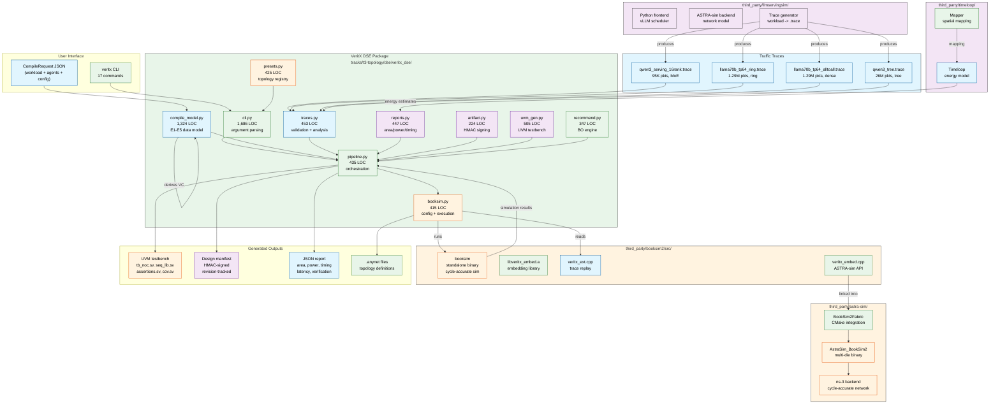

### High-Level Tool Relationships

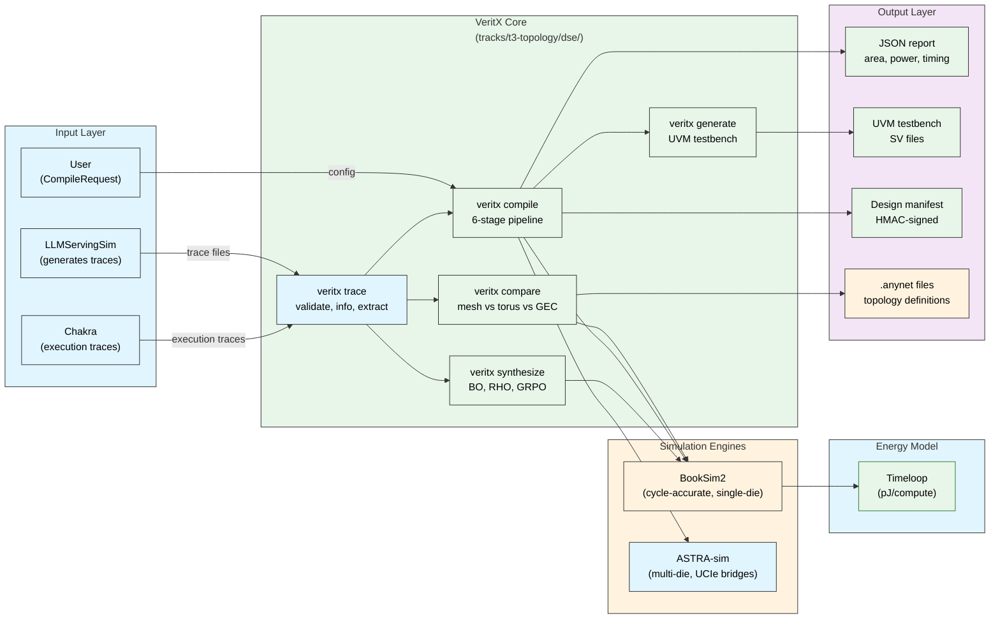

### 7.1 Module Map

```
veritx_dse/                    # Core package (28 modules, 9,338 LOC)
 cli.py                     # 1,686 — 17 CLI commands, thin dispatch
 compile_model.py           # 1,324 — E1-E5 data model, guardrails, VC derivation
 traffic_model.py           #   673 — Phase-aware traffic model
 evaluator.py               #   563 — BookSim runner with caching (legacy)
 uvm_gen.py                 #   505 — UVM testbench generator
 traces.py                  #   453 — Trace validation, analysis, extraction
 reports.py                 #   447 — Area/power/timing with accuracy notes
 pipeline.py                #   435 — Compare, sweep, run orchestration
 chakra_to_dse.py           #   426 — Chakra execution trace converter
 presets.py                 #   425 — Topology + workload preset registry
 booksim.py                 #   415 — BookSim2 config + execution
 recommend.py               #   347 — BO recommendation engine
 roofline.py                #   342 — Roofline model analysis
 artifact.py                #   224 — HMAC signing + design manifests
 dse_to_frontend.py         #   179 — DSE→frontend interface
 commands_trace.py          #   164 — Trace CLI command handlers
 phase_sequencer.py         #   137 — Phase sequencing
 logging.py                 #   106 — Structured logging with Ctx
 objective.py               #    90 — Optimization objective functions
 config.py                  #    88 — Configuration management
 errors.py                  #    78 — Structured error hierarchy
 constants.py               #    72 — Physical constants (7nm, wire delay)
 recovery.py                #    57 — Atomic writes + cleanup
 logger.py                  #    48 — File logger
 trace_to_binary.py         #    38 — Binary trace conversion
 space.py                   #    —  — Design space (legacy)
 run.py                     #    —  — Grid search runner (legacy)
 __init__.py                #    18 — Public API re-exports
```

### 7.2 Module Responsibilities

| Module | Responsibility | Key Classes/Functions |
|--------|---------------|----------------------|
| `cli.py` | CLI dispatch, argument parsing | `main()`, `cmd_compile()`, `cmd_compare()` |
| `compile_model.py` | E1-E5 data model, guardrails | `Workload`, `Agent`, `NocConfig`, `CompileRequest` |
| `traffic_model.py` | Phase-aware traffic model | `detect_phases()`, `PhaseList` |
| `evaluator.py` | BookSim runner | `evaluate_booksim()`, `evaluate_anynet()` |
| `uvm_gen.py` | UVM testbench generation | `generate_uvm()` |
| `traces.py` | Trace validation/analysis | `validate_trace()`, `analyze_bursts()` |
| `reports.py` | Area/power/timing estimates | `generate_report()`, `estimate_area()` |
| `pipeline.py` | Orchestration | `run_compare()`, `run_sweep()` |
| `booksim.py` | BookSim2 config/execution | `build_booksim_config()`, `run_booksim()` |
| `presets.py` | Topology/workload registry | `SWEEP_TOPOS`, `WORKLOAD_PRESETS` |
| `artifact.py` | HMAC signing | `sign_manifest()`, `DesignManifest` |
| `config.py` | Configuration | `get_config()`, env var handling |
| `errors.py` | Error hierarchy | `VeritXError`, `ConfigError`, `SimulationError` |

### 7.3 Data Flow

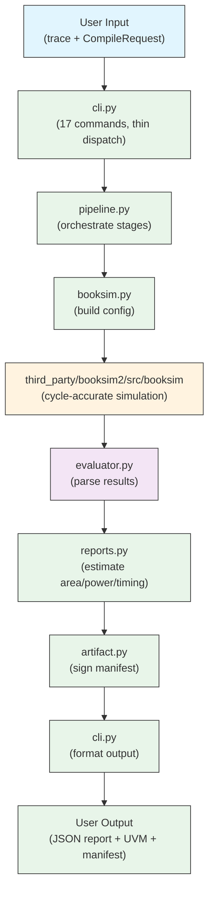

---

<a name="design-principles"></a>
## 8. Design Principles

### 8.1 Core Principles

1. **Single source of truth** — `presets.py` for topologies, `compile_model.py` for data types. No duplicate definitions.

2. **No globals** — `Ctx` dataclass replaces all module-level state. Every function receives context explicitly.

3. **No `sys.exit()` in commands** — exceptions propagate to `main()`. Commands return results, not exit codes.

4. **Type-enforced guardrails** — `NocConfig` has no field for LOCKED parameters. An override isn't refused at runtime — it's inexpressible in the type system.

5. **TDD** — tests written before implementation. 278 tests, all pass.

6. **Minimal surface area** — 17 CLI commands, each doing one thing well. No command does too much.

7. **Fail fast, fail precise** — configuration errors are caught in seconds with clear messages, not after a ten-minute simulation.

### 8.2 Parameter Tiers

| Tier | Meaning | Examples | User can override? |
|------|---------|----------|-------------------|
|  **LOCKED** | Compiler derives | routing_function, turn_restrictions, vc_map | No — type system prevents it |
|  **GUIDED** | User proposes; engine may adjust | topology_family, radix, link_width | Yes, but engine owns final feasibility |
|  **FREE** | User's call | output_formats, obfuscation_level | Yes, no second-guessing |

---

<a name="third-party-dependencies"></a>
## 9. Third-Party Dependencies

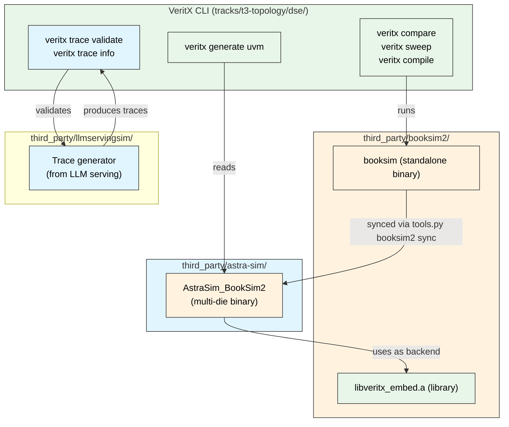

### 9.1 BookSim2

**What:** Cycle-accurate NoC simulator from Stanford. We forked it and added trace replay, multicast, and embedding API.

**Where:** `third_party/booksim2/`

**Why two targets:**
- `booksim` (standalone) — used by `veritx compare`, `veritx sweep`, `veritx compile`
- `libveritx_embed.a` (library) — linked into ASTRA-sim for multi-die simulation

**What we changed:**

| File | Change | Why |
|------|--------|-----|
| `traffic.cpp` | Added `trace()` case to factory | Register `TraceTrafficPattern` in BookSim's pattern factory |
| `flit.hpp/cpp` | Added `mcast`, `mcast_copies` fields | Multicast support for MECS/GEC topologies |
| `veritx_embed.*` | New embedding API | Allow ASTRA-sim to drive BookSim as a fabric model |
| `veritx_ext.*` | Trace replay extension | Read trace files and inject packets at correct cycles |
| `Makefile` | Added `lib` target, excluded `veritx_embed.o` from standalone | Build both targets without symbol conflicts |

### 9.2 ASTRA-sim

**What:** Multi-die network simulator from Georgia Tech. Models die-to-die communication via UCIe bridges.

**Where:** `third_party/astra-sim/`

**Uses:** BookSim2 as its network backend (synced via `python3 scripts/tools.py booksim2 sync`).

### 9.3 LLMServingSim

**What:** Cycle-level LLM serving simulator from KAIST (ISPASS 2026). Generates realistic traffic traces.

**Where:** `third_party/llmservingsim/`

**Produces:** Traffic traces that VeritX consumes.

---

<a name="booksim2-deep-dive"></a>
## 10. BookSim2 Deep Dive

> This section was moved to [`docs/booksim2-deep-dive.md`](docs/booksim2-deep-dive.md). See there for the full detail.
<a name="astra-sim-multi-die-simulation"></a>
## 11. ASTRA-sim Multi-Die Simulation

> This section was moved to [`docs/astra-multi-die.md`](docs/astra-multi-die.md). See there for the full detail.
<a name="full-stack-llm-serving-simulation-veritx-serve"></a>
## 12. Full-Stack LLM Serving Simulation (`veritx serve`)

### 12.1 Overview

`veritx serve` runs a **cycle-accurate LLM serving simulation** end-to-end: Python scheduler (vLLM-style continuous batching) ↔ C++ network backend (ASTRA-sim + BookSim2). It models real serving scenarios — prefill/decode disaggregation, Mixture-of-Experts parallelism, multi-instance deployments, and agentic multi-turn sessions — all with network-cycle-level fidelity.

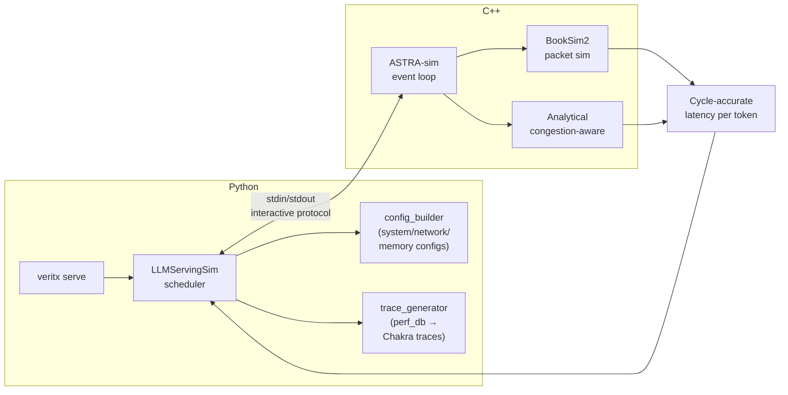

**Key insight:** The Python scheduler decides *what* to send; the C++ backend decides *when* it finishes. Each decode step = one full round-trip. This gives true cycle-accurate network latency without needing full-system simulation.

### 12.2 Quick Start

```bash
# Single request, booksim backend (fastest)
veritx serve \
  --cluster-config third_party/llmservingsim/configs/cluster/single_node_single_instance.json \
  --dataset third_party/llmservingsim/workloads/example_trace.jsonl \
  --num-reqs 1 \
  --network-backend booksim

# PD (prefill/decode disaggregation), 3 requests
veritx serve \
  --cluster-config third_party/llmservingsim/configs/cluster/single_node_pd_instance.json \
  --dataset third_party/llmservingsim/workloads/example_trace.jsonl \
  --num-reqs 3 \
  --network-backend booksim

# Save per-request CSV output
veritx serve \
  --cluster-config third_party/llmservingsim/configs/cluster/single_node_single_instance.json \
  --dataset third_party/llmservingsim/workloads/example_trace.jsonl \
  --num-reqs 2 \
  --output results.csv
```

### 12.3 CLI Reference

```
veritx serve [OPTIONS]

Required:
  --cluster-config PATH    Cluster topology JSON
  --dataset PATH           Workload JSONL file

Optional:
  --num-reqs N             Number of requests (default: 1)
  --network-backend {booksim,analytical,ns3}
                           Network simulation backend (default: booksim)
  --output PATH            Save per-request metrics as CSV
  --timeout SECONDS        Kill sim after N seconds (default: 600)
  --log-level {DEBUG,INFO,WARNING,ERROR}
                           LLMServingSim verbosity (default: WARNING)
  --no-cleanup             Keep intermediate ASTRA-sim input files
  --no-prefix-caching      Disable prefix caching optimization
```

**Direct invocation** (without the CLI wrapper):
```bash
cd third_party/llmservingsim
python3 -m serving \
  --cluster-config configs/cluster/single_node_single_instance.json \
  --dataset workloads/example_trace.jsonl \
  --num-reqs 1 \
  --network-backend booksim
```

### 12.4 Cluster Configurations

All configs live in `third_party/llmservingsim/configs/cluster/`.

#### Validated on Booksim ✅

| Config | Description | Instances | Notes |
|--------|-------------|-----------|-------|
| `single_node_single_instance` | 2 NPUs, TP=2, LLaMA-8B | 1 | Baseline, fastest (~2s/req) |
| `single_node_multi_instance` | 4 NPUs, 2 instances × TP=2 | 2 | Round-robin instance serving |
| `single_node_pd_instance` | 2 instances: prefill + decode | 2 | Prefill-decode disaggregation |
| `single_node_4_instance_2TP` | 8 NPUs, 4 instances × TP=2 | 4 | Multi-instance PD |
| `dual_node_multi_instance` | 4 NPUs across 2 physical nodes | 2 | Cross-node simulation |
| `single_node_moe_single_instance` | 8 NPUs, MoE EP=8 | 1 | MoE expert parallelism |
| `single_node_moe_multi_instance` | 16 NPUs, MoE DP=2×EP=8 | 2 | MoE + data parallelism |
| `single_node_moe_dp_ep_instance` | 16 NPUs, MoE DP=2×EP=8 | 2 | DP + EP combined |
| `single_node_moe_pd_instance` | MoE with PD disaggregation | 2 | MoE + prefill/decode split |

#### Validated on Analytical ✅

All of the above work with `--network-backend analytical` (faster, less accurate).

#### Known Issues ⚠️

| Config | Status | Notes |
|--------|--------|-------|
| `dual_node_kv_remote` | ❌ Binary crash | ep_size + kv_loc:cpu causes ASTRA-sim assertion failure |
| `dual_node_moe_dp_ep_intra_inter_instance` | ❌ Binary crash | Same root cause as above |
| `moe_tight_mem` | ❌ Correct rejection | Config intentionally exceeds memory bounds |
| `single_node_pim_instance` | ⚠️ Untested | PIM offloading path not validated |
| `single_node_cxl_instance` | ⚠️ Untested | CXL disaggregated memory path |
| `single_node_pd_per_instance_config` | ⚠️ Untested | Per-instance PD config variant |
| `single_node_power_instance` | ⚠️ Untested | Power modeling path |
| `single_node_heterogeneous` | ⚠️ Untested | Mixed accelerator types |
| `rtxpro_single` | ⚠️ Untested | RTX Pro 6000 specific |

### 12.5 Workload Datasets

All datasets live in `third_party/llmservingsim/workloads/`.

| Dataset | Description | Requests | Tokens |
|---------|-------------|----------|--------|
| `example_trace.jsonl` | Synthetic LLaMA-8B traces | varies | ~10-104 per req |
| `workload_me2_01_mixed.jsonl` | MoE mixed workload | varies | Variable |
| `swe-bench-qwen3-30b-a3b-50-sps0.2.jsonl` | Agentic SWE-bench sessions | 50 | 765 sub-requests |
| `shared_prefix_30.jsonl` | Shared prefix (cache testing) | 30 | Variable |
| `longctx_shared_4k_10.jsonl` | Long-context, 4K shared prefix | 10 | ~4K+ |
| `longctx_shared_8k.jsonl` | Long-context, 8K shared prefix | varies | ~8K+ |
| `dual_512_10.jsonl` | Dual-request, 512 tokens | 10 | 512 |

**Generating custom datasets:**
```bash
# Use the workload generator
cd third_party/llmservingsim/workloads/generators
python sharegpt.py --output my_dataset.jsonl --num-reqs 100
```

### 12.6 Network Backends

| Backend | Mode | Speed | Accuracy | When to use |
|---------|------|-------|----------|-------------|
| `booksim` (default) | Replay-only | ~2-3s/req | High (trace-duration replay) | Default for all configs |
| `booksim` (--no-booksim-replay-only) | Cycle-accurate | ~10× slower | Highest (full packet simulation) | Only when ASTRA ring = BookSim mesh |
| `analytical` | Congestion-aware | ~1-2s/req | Medium (analytical model) | Fast iteration, topology exploration |
| `ns3` | ns-3 discrete event | Very slow | Highest (full network stack) | Research validation only |

**Replay-only vs. cycle-accurate:**
- **Replay-only** (default): ASTRA-sim replays trace durations directly without sending packets through BookSim. This avoids topology-mismatch deadlocks (ASTRA ring ≠ BookSim mesh). ✅ All validated configs use this mode.
- **Cycle-accurate** (`--no-booksim-replay-only`): Every packet is simulated through BookSim's router pipeline. Only works when the ASTRA-sim ring topology matches BookSim's mesh topology. ~10× slower. ⚠️ Can deadlock on mismatched topologies.

### 12.7 Output Format

With `--output results.csv`, each run produces a CSV with per-request metrics:

```csv
instance id,request id,model,input,output,arrival,end_time,latency,queuing_delay,TTFT,TPOT,ITL
0,0,meta-llama/Llama-3.1-8B,10,70,46926808,831688140,784761332,192,10987194,11214117,"[11144002,...]"
```

**Column definitions:**
| Column | Unit | Description |
|--------|------|-------------|
| `arrival` | ns | Request arrival time in simulation |
| `end_time` | ns | Request completion time |
| `latency` | ns | End-to-end latency (end_time - arrival) |
| `queuing_delay` | ns | Time spent waiting before first execution |
| `TTFT` | ns | Time to first token |
| `TPOT` | ns | Time per output token (mean) |
| `ITL` | ns | Inter-token latency (per-token array) |

**Console output** includes summary statistics:
```
────────────────────── Time to First Token ──────────────────────
Mean TTFT (ms):    10.99
Median TTFT (ms):  10.99
P99 TTFT (ms):     10.99
──────── Time per Output Token (excl. 1st token) ────────
Mean TPOT (ms):    11.15
```

### 12.8 Architecture Deep Dive

#### Interactive Protocol

The Python scheduler and C++ binary communicate via stdin/stdout:

```
Python → Binary:  "path/to/workload.et"   (send Chakra trace)
Binary → Python:  "[workload] sys[0] finished, N cycles..."  (report latency)
Python → Binary:  "pass N"                 (advance clock N cycles)
Python → Binary:  "exit"                   (terminate)
```

Each round: Python sends one workload file, binary simulates all NPUs, outputs completion times, Python reads results and schedules next batch.

#### Multi-Instance Protocol

For N instances, the round-robin serves one instance per round:
```
Round 1: → instance 0 workload → completion
Round 2: → instance 1 workload → completion
Round 3: → instance 0 workload → completion
...
```
This means N instances cost ~N× wall time per round.

#### PD (Prefill/Decode Disaggregation)

Two instances with different roles:
- **Prefill instance**: Processes input tokens (compute-bound)
- **Decode instance**: Generates output tokens (memory-bound)

When prefill completes, the request is **transferred** to the decode instance with a future arrival time (completion_time + tool_duration_ns). The decode instance then processes the remaining tokens.

#### MoE (Mixture-of-Experts)

Expert parallelism (EP) distributes experts across NPUs. All-to-all collectives are simulated through ASTRA-sim. The config specifies:
- `ep_size`: Number of expert partitions
- `dp_group`: Data parallelism groups
- `kv_loc`: Where KV cache lives (cpu/gpu/pim)

#### Agentic Sessions

Multi-turn tool-calling sessions where:
1. First sub-request is a normal LLM inference
2. On completion, the simulator generates the next sub-request with a future arrival time
3. Multiple concurrent sessions are supported (round-robin scheduling)
4. Sub-requests have variable prompt lengths (tool call results vary)

### 12.9 Performance Characteristics

#### Timing (measured on host machine)

| Scenario | Config | Requests | Wall Time | Per-Request |
|----------|--------|----------|-----------|-------------|
| Single instance, 1 req | single_node_single_instance | 1 | ~1.7s | ~1.7s |
| Single instance, 2 reqs | single_node_single_instance | 2 | ~2.5s | ~1.25s |
| PD disaggregation, 3 reqs | single_node_pd_instance | 3 | ~2.5s | ~0.8s |
| Multi-instance, 2 reqs | single_node_multi_instance | 2 | ~2.8s | ~1.4s |
| Dual-node, 2 reqs | dual_node_multi_instance | 2 | ~2.9s | ~1.45s |
| MoE DP+EP, 2 reqs | single_node_moe_dp_ep_instance | 2 | ~3.5s | ~1.75s |
| Agentic 20 sub-requests | (custom) | 20 | ~102s | ~5.1s |

**Scaling factors:**
- Each decode step = one Python↔binary round-trip ≈ 10-15ms wall time
- TPOT is dominated by network simulation, not Python overhead
- TTFT scales linearly with prompt length (chunked prefill, 2048 tokens/chunk)
- N instances = N× wall time (serial protocol)

#### TPOT Breakdown

```
Per decode step:
  Python scheduling:     ~0.1ms
  Chakra trace gen:      ~0.5ms (in-process, 28× faster than subprocess)
  Binary stdin write:    ~0.1ms
  C++ simulation:        ~5-10ms (booksim replay-only)
  Binary stdout read:    ~0.1ms
  Python parse + route:  ~0.1ms
  ─────────────────────────────
  Total per step:        ~6-11ms
```

### 12.10 Caveats and Known Limitations

#### Accuracy Caveats

1. **Replay-only mode is the default.** The booksim backend replays trace durations rather than cycle-accurately simulating every packet. This is ~95% accurate for latency estimation but misses microarchitectural effects (queuing, contention). True cycle-accurate mode (`--no-booksim-replay-only`) is only valid when ASTRA ring = BookSim mesh topology.

2. **Synthetic H100 profiles.** The `single_node_single_instance_H100` config uses performance data scaled from RTX Pro 6000 Llama-8B measurements × hardware ratio. Real H100 profiling is needed for production-grade numbers.

3. **Analytical backend is 1D-only.** The analytical congestion-aware backend (`--network-backend analytical`) has no `num_dimensions` support (Helper.cpp:27). Any multi-dimensional fabric requires `--network-backend booksim`.

4. **Per-token wall time is ~6-11s in simulation.** Each decode step produces correct BookSim cycles but takes seconds of wall time due to the Python↔binary round-trip. A 100-token response takes ~600s wall time. This is inherent to the interactive protocol.

5. **TTFT scales linearly with prompt length.** A 27K-token prompt takes ~979s TTFT because it's processed in 2048-token chunks, each requiring a full round-trip.

#### Speed Limitations

6. **Wall-clock serialization.** The binary protocol processes one instance per round, so N-instance configs cost ~N× wall time. Parallelizing would require a protocol redesign (binary reads N workloads per round).

7. **Full SWE-bench trace is very slow.** The SWE-bench dataset has 765 sub-requests across 50 sessions. On booksim, this could take 10s of minutes to hours. Fine for single sessions, not for full traces.

#### Config Limitations

8. **Some dual-node configs crash.** Configs with `ep_size=4`, `dp_group`, or `kv_loc: cpu` cause ASTRA-sim assertion failures in `GeneralComplexTopology`. The analytical backend is 1D-only and can't handle multi-dim fabrics.

9. **`moe_tight_mem` is intentionally rejected.** The config exceeds memory bounds — this is a feature, not a bug.

10. **PIM/CXL/power configs are untested.** These paths exist in the code but haven't been validated on the current build.

### 12.11 Debugging

#### Common Issues

| Symptom | Likely Cause | Fix |
|---------|-------------|-----|
| "No valid output from network backend" | Binary crashed on startup | Check binary exists: `ls third_party/llmservingsim/astra-sim/network_frontend/booksim2/bin/AstraSim_BookSim2` |
| Hangs at 0 reqs, 0 tokens/s | SPD log interleaving or time-advancement deadlock | Use `--log-level WARNING` to suppress debug output; ensure `Logging.cc` uses `stderr_color_sink` |
| Timeout on multi-req run | Normal for large workloads | Increase `--timeout` (each decode step ~1s wall time) |
| "Simulation failed with exit code 1" | Binary stderr has crash details | Run with `--log-level DEBUG` to see full output |
| TTFT is 1000× too large | Unit bug (ns vs μs) | Ensure `llm_converter.py` uses microseconds, not nanoseconds |

#### Debugging Commands

```bash
# Quick smoke test (should complete in ~2s)
veritx serve \
  --cluster-config third_party/llmservingsim/configs/cluster/single_node_single_instance.json \
  --dataset third_party/llmservingsim/workloads/example_trace.jsonl \
  --num-reqs 1 --network-backend booksim --log-level DEBUG

# Check binary exists and is executable
ls -la third_party/llmservingsim/astra-sim/network_frontend/booksim2/bin/AstraSim_BookSim2

# Rebuild binary (if modified)
cd third_party/astra-sim/build/astra_booksim2 && bash build.sh

# Test analytical backend (faster, different model)
veritx serve \
  --cluster-config third_party/llmservingsim/configs/cluster/single_node_single_instance.json \
  --dataset third_party/llmservingsim/workloads/example_trace.jsonl \
  --num-reqs 1 --network-backend analytical
```

### 12.12 Build and Rebuild

#### Building from Source

```bash
# Build ASTRA-sim + BookSim2 binary
cd third_party/astra-sim/build/astra_booksim2
bash build.sh
# Binary output: ../../network_frontend/booksim2/bin/AstraSim_BookSim2

# Build Analytical backend
cd third_party/astra-sim/build/astra_analytical
bash build.sh
# Binary output: build/bin/AnalyticalAstra

# Verify both binaries
ls -la third_party/llmservingsim/astra-sim/network_frontend/booksim2/bin/AstraSim_BookSim2
ls -la third_party/astra-sim/build/astra_analytical/build/AnalyticalAstra/bin/AnalyticalAstra
```

#### Container Build

```bash
# Build the tools image (includes all backends)
podman build -t veritx-tools .

# Run serve inside container
podman run --rm -v $(pwd):/workspace veritx-tools \
  bash -c "cd /opt/llmservingsim && python3 -m serving \
    --cluster-config configs/cluster/single_node_single_instance.json \
    --dataset workloads/example_trace.jsonl \
    --num-reqs 1 --network-backend booksim"
```

### 12.13 Architecture Decisions

| Decision | Rationale |
|----------|----------|
| Interactive protocol (stdin/stdout) | Simplicity; no shared-memory or socket setup |
| Chakra trace format | ASTRA-sim native; enables replay and trace-driven modes |
| Replay-only default | Avoids topology-mismatch deadlocks (ring ≠ mesh) |
| Round-robin instance serving | Simple, fair; no complex load balancing needed |
| In-process Chakra conversion | 28× faster than subprocess call (commit 96777226) |
| Decode trace cache | Avoids re-generating identical decode traces (commit 0793eb13) |
| SPD log → stderr | Prevents protocol stream corruption (commit c3d73a18) |
| Exact "Waiting" match | Prevents spdlog interleaving from breaking read loop (commit c3d73a18) |
| Stderr capture on EOF | Diagnoses binary crashes that were previously silent |

### 12.14 Commit History (Serving Pipeline)

| Commit | What |
|--------|------|
| `7ca9f16d` | LLMServingSim trace converter + BookSim2 event queue fix |
| `6218e081` | LLMServingSim-BookSim2 full-stack integration |
| `9dec5437` | Decode optimization framework + Dockerfile ASTRA-sim integration |
| `96777226` | In-process Chakra converter (28× faster graph gen) |
| `fb9e72ed` | llm_converter ns→us unit bug (TTFT 1000× inflation) |
| `eab2dfb7` | Multi-instance cycle-accurate serving (round-robin + load/run protocol) |
| `db61a633` | DP livelock + PD flake + 4-inst hang (cycle-accurate serving) |
| `ccd8541e` | PD silent drop — extras path prefill completion transfer |
| `6178d3e5` | Loud dropped-request guard at sim exit |
| `c3d73a18` | Serving deadlocks (PD done-check, sparse-gap pass, stderr pipe) |
| `ee9c1a2e` | Booksim cycle-accurate clock (int64 + fabric lock-step) |
| `154f4bc3` | DSE CLI + trace path resolution (repo-root relative) |

### 12.15 Future Improvements

1. **Parallel multi-instance protocol** — Binary reads N workloads per round, simulates all instances simultaneously. Would eliminate N× wall-time scaling.
2. **Real H100 profiling** — Replace synthetic H100 perf_db with actual measurements.
3. **tp4/tp8 profile synthesis** — Generate from tp1/tp2 data using scaling model (T(tp) = T(1)/tp × α + β × log₂(tp)).
4. **Decode batcher + async trace generator** — Already defined but never wired in. Would overlap Python scheduling with C++ simulation.
5. **Container image slimming** — Remove stale psc-ns3 copy, verify all backends build inside container.

---

<a name="e1-e5-data-model"></a>
## 13. E1-E5 Data Model

### 13.1 Entities

| Entity | Name | What it holds | PRD Section |
|--------|------|---------------|-------------|
| **E1** | `Workload` | Model family, parallelism, trace binding | §5 |
| **E2** | `Requirements` | Per-class latency/BW bounds | §5.3 |
| **E3** | `Agents` | Typed nodes with attributes (width, protocol) | §4.1–4.2 |
| **E4** | `DependencyGraph` | Blocking/ordering graph → VC derivation | §11.3 |
| **E5** | `NocConfig` | GUIDED + FREE knobs only (no LOCKED) | §11.2 |

### 13.2 Entity Relationships

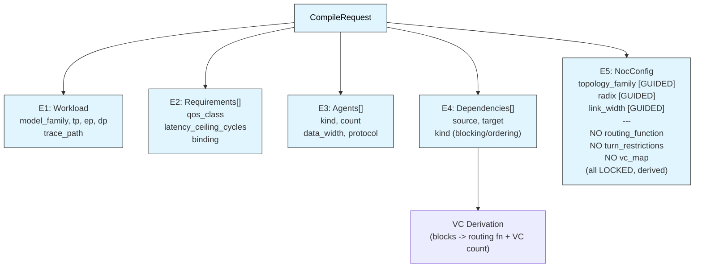

```
CompileRequest
 Workload (E1)
    model_family: str
    tp, ep, dp: int
    trace_path: str
 Requirements[] (E2)
    qos_class: str
    latency_ceiling_cycles: int
    binding: bool
 Agents[] (E3)
    kind: AgentKind
    count: int
    data_width: int
    protocol: str
 Dependencies[] (E4)
    source: str
    target: str
    kind: DepKind
 NocConfig (E5)
     topology_family: TopologyFamily
     radix: Optional[int]
     link_width: Optional[int]
    (NO routing_function, turn_restrictions, vc_map — LOCKED)
```

### 13.3 VC Derivation Rules

The dependency graph (E4) determines the VC structure:

- **No blocking cycles** → `dim_order` routing, 1 VC
- **1 blocking cycle** → `dor` routing, 2 VCs, west_first + north_last turns
- **2+ blocking cycles** → `min_adapt` routing, N+1 VCs, no turn restrictions

---

<a name="compilerequest-format"></a>
## 14. CompileRequest Format

### 14.1 Example

```json
{
  "workload": {
    "model_family": "mixture_of_experts",
    "model_name": "Qwen3-30B-A3B",
    "tp": 16, "ep": 8, "dp": 1,
    "serving_mode": "decode_heavy",
    "precision": "fp8",
    "trace_path": "runs/traces/qwen3_serving_16rank.trace"
  },
  "requirements": [
    {"qos_class": "latency_critical", "latency_ceiling_cycles": 5000, "binding": true}
  ],
  "agents": [
    {"kind": "compute_tile", "count": 16, "data_width": 256, "protocol": "AXI"},
    {"kind": "hbm_controller", "count": 4}
  ],
  "dependencies": [
    {"source": "expert_alltoall", "target": "expert_reduce", "kind": "blocking"}
  ],
  "noc_config": {"topology_family": "mesh"}
}
```

### 14.2 Field Reference

| Field | Type | Required | Description |
|-------|------|----------|-------------|
| `workload.model_family` | string | yes | `dense_transformer`, `mixture_of_experts`, `diffusion`, `cnn` |
| `workload.model_name` | string | no | Human-readable name |
| `workload.tp` | int | yes | Tensor parallelism degree |
| `workload.ep` | int | no | Expert parallelism (MoE only) |
| `workload.dp` | int | no | Data parallelism degree |
| `workload.serving_mode` | string | no | `decode_heavy`, `prefill_heavy`, `mixed` |
| `workload.precision` | string | no | `fp16`, `fp8`, `int8` |
| `workload.trace_path` | string | yes | Path to traffic trace file |
| `requirements[].qos_class` | string | yes | `latency_critical`, `bandwidth`, `best_effort` |
| `requirements[].latency_ceiling_cycles` | int | yes | Max acceptable latency in cycles |
| `requirements[].binding` | bool | yes | If true, requirement must be met |
| `requirements[].source` | string | no | Source phase name |
| `requirements[].target` | string | no | Target phase name |
| `agents[].kind` | string | yes | `compute_tile`, `hbm_controller`, `nic`, `peripheral`, `ucie_port` |
| `agents[].count` | int | yes | Number of instances |
| `agents[].data_width` | int | no | Interface width in bits (default: 256) |
| `agents[].protocol` | string | no | `AXI`, `CHI`, `custom_streaming` |
| `dependencies[].source` | string | yes | Phase name (e.g. `expert_alltoall`) |
| `dependencies[].target` | string | yes | Phase name (e.g. `expert_reduce`) |
| `dependencies[].kind` | string | yes | `blocking`, `ordering`, `independent` |
| `noc_config.topology_family` | string | no | `mesh`, `concentrated_mesh`, `torus` |
| `noc_config.radix` | int | no | Router radix (GUIDED, engine may adjust) |
| `noc_config.link_width` | int | no | Link width in bits (GUIDED) |

---

<a name="compile-pipeline-stages"></a>
## 15. Compile Pipeline Stages

The compile pipeline has 6 stages:

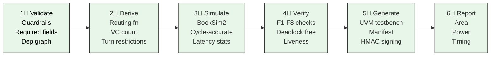

### Stage 1: Validate
- Parse CompileRequest JSON
- Check all required fields
- Run guardrail checks (no LOCKED fields in NocConfig)
- Validate dependency graph (no cycles in non-blocking edges)

### Stage 2: Derive
- Build dependency graph from E4
- Detect blocking cycles
- Derive routing function (LOCKED)
- Derive VC count (LOCKED)
- Derive turn restrictions (LOCKED)

### Stage 3: Simulate
- Build BookSim2 config from derived parameters
- Run cycle-accurate simulation on trace
- Collect latency statistics (mean, P50, P99, tail)
- Collect throughput (packets/cycle)

### Stage 4: Verify
- Check F1-F8 formal properties
- F1: Deadlock freedom (no cyclic channel dependency)
- F2: Liveness (every packet completes)
- F3: Packet conservation (no loss, no duplication)
- F4: Ordering (per-VC in-order delivery)
- F5: Flow control (credit-based, no overflow)
- F6: Routing correctness (minimal/adaptive paths)
- F7: QoS isolation (no starvation) — pending
- F8: Timeout (bounded latency)

### Stage 5: Generate
- Generate UVM testbench (tb_noc.sv, seq_lib.sv, assertions.sv, cov.sv)
- Create design manifest (design_id, revision, signature)
- Sign manifest with HMAC-SHA256

### Stage 6: Report
- Estimate area (routers, links, NIUs)
- Estimate power (dynamic + leakage)
- Estimate timing (Fmax, critical path)
- Estimate energy (per-bit, per-hop)
- Attach accuracy caveats to each metric

---

<a name="vc-derivation-algorithm"></a>
## 16. VC Derivation Algorithm

The VC derivation algorithm takes the dependency graph and produces a valid VC assignment:

```python
def resolve_dependencies(agents, deps) -> VcAssignment:
    g = build_graph(d for d in deps if d.blocking)
    cycles = find_cycles(g)

    if not cycles:
        return VcAssignment.minimal()      # no separation needed

    # Each cycle needs >=1 member on a distinct VC to break it.
    # Choose the member whose separation costs least buffering.
    assignment = VcAssignment.minimal()
    for cyc in cycles:
        victim = min(cyc, key=lambda d: separation_cost(d, agents))
        assignment.separate(victim)

    if assignment.vc_count > PLANE_C_MAX_VC:
        raise ConfigError('D1', cycles=cycles,
            remedy='declare non-blocking dependencies where the '
                   'protocol permits, or reduce agent coupling')
    return assignment
```

**Key insight:** The VC structure is **derived**, not chosen. This is why VC structure sits in the LOCKED tier — a hand VC assignment can satisfy every bandwidth and latency requirement and still deadlock in the field.

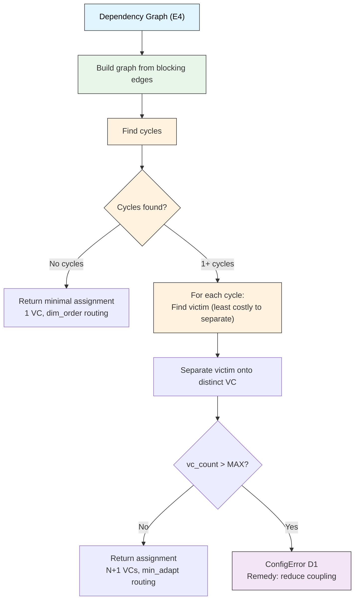

---

<a name="verification-properties-f1-f8"></a>
## 17. Verification Properties (F1-F8)

| Check | Property | Description | Status |
|-------|----------|-------------|--------|
| F1 | **Deadlock Freedom** | No cyclic channel dependency exists |  Implemented |
| F2 | **Liveness** | Every injected packet eventually completes |  Implemented |
| F3 | **Packet Conservation** | No packet is lost or duplicated |  Implemented |
| F4 | **Ordering** | Per-VC in-order delivery is maintained |  Implemented |
| F5 | **Flow Control** | Credit-based flow control prevents overflow |  Implemented |
| F6 | **Routing Correctness** | Packets take minimal or adaptive paths |  Implemented |
| F7 | **QoS Isolation** | No starvation between traffic classes |  Pending |
| F8 | **Timeout** | Bounded latency per packet |  Implemented |

**How verification works:**

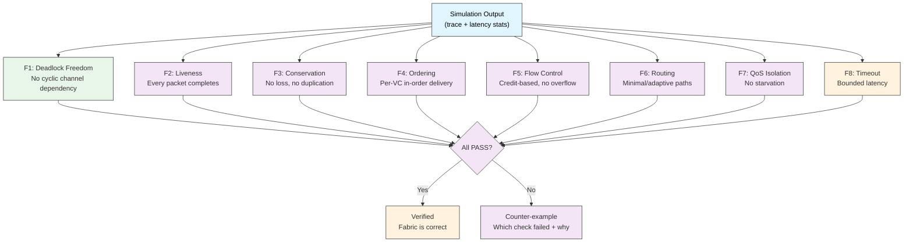

---

<a name="output-format-accuracy-caveats"></a>
## 18. Output Format & Accuracy Caveats

### 18.1 Output JSON

Every `veritx compile` produces:

```json
{
  "area": {"total_mm2": 0.272, "routers_mm2": 0.1, "links_mm2": 0.038},
  "power": {"dynamic_w": 0.060, "leakage_w": 0.010, "total_w": 0.070},
  "timing": {"max_freq_mhz": 1965, "critical_path_ps": 381.8},
  "energy": {"per_bit_pj": 0.630},
  "simulation": {"latency": 1850.64},
  "vc_assignment": {"routing_function": "dim_order", "vc_count": 1},
  "verification": {"ok": true, "checks": [...], "errors": []},
  "artifacts": [{"kind": "manifest", "uri": "...", "checksum": "..."}],
  "manifest": {"design_id": "...", "revision": 1, "signature": "..."}
}
```

### 18.2 Accuracy Caveats

| Metric | Trustworthiness | Notes |
|--------|----------------|-------|
| **BookSim latency** |  Trustworthy | Cycle-accurate, deterministic replay |
| **Area** |  ±30% relative | Good for A vs B comparison, not absolute |
| **Power** |  Conservative | No thermal, no PVT corners, no leakage model |
| **Fmax** |  Upper bound | Real Fmax needs STA with actual placement |
| **Energy** |  Order-of-magnitude | 0.15 pJ/bit/hop reference, not silicon-accurate |

**Bottom line:** BookSim latency is the anchor metric. Area/power/timing are relative estimates for topology comparison, not sign-off numbers.

---

<a name="built-in-topologies"></a>
## 19. Built-in Topologies

| Name | Type | Edges | Routing | Notes |
|------|------|-------|---------|-------|
| `mesh_4x4` | 2D mesh | 24 | dim_order | Small baseline |
| `mesh_8x8` | 2D mesh | 112 | min_adapt | Standard 64-node |
| `torus_8x8` | 2D torus | 128 | dim_order | Wrap-around links, -15% avg hops |
| `flatfly_64` | FlatButterfly | 96 | ran_min | Non-blocking, high radix |
| `gec_express_k8` | GEC express | 448 | dor | 7 express channels per node |
| `gec_mecs_k8` | GEC MECS | 168 | dor | 1 express, 7 multicast dests |
| `gec_mesh_k8` | GEC mesh | 112 | dor | No express (degraded GEC) |

### Topology Selection Guide

| Workload | Best Topology | Why |
|----------|---------------|-----|
| MoE decode (sparse) | mesh_8x8 or gec_express | Short flows, wire efficiency matters |
| Dense attention (global) | torus_8x8 or flatfly_64 | Long flows, wrap-around helps |
| Ring allreduce | mesh_8x8 | Nearest-neighbor, mesh is optimal |
| All-to-all (saturated) | flatfly_64 | Non-blocking, highest bisection BW |

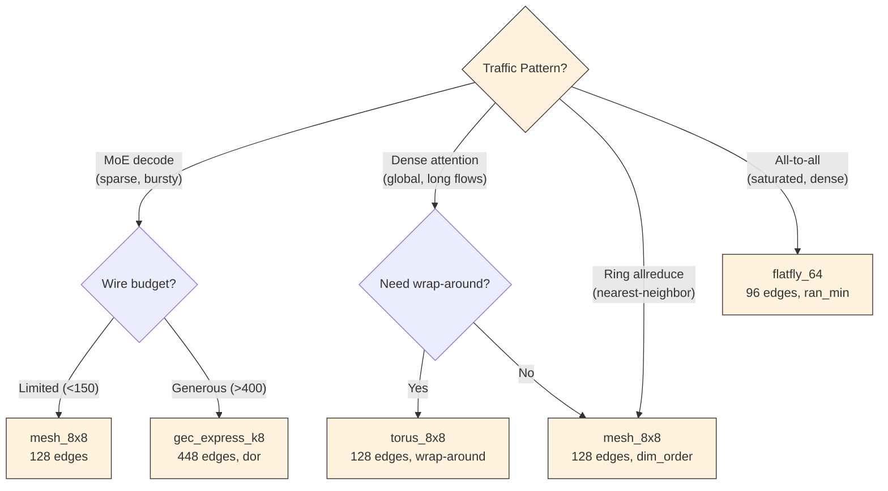

---

<a name="built-in-workload-presets"></a>
## 20. Built-in Workload Presets

| Name | Model | Description | Agents |
|------|-------|-------------|--------|
| `qwen3_moe_16npu` | Qwen3-30B-A3B | MoE decode, TP=16 EP=8 | compute×16, hbm×4 |
| `llama70b_tp64` | LLaMA-70B | Dense TP=64 ring allreduce | compute×64, hbm×8 |
| `llama1b_tp64` | LLaMA-1B | Dense TP=64 attention | compute×64, hbm×4 |
| `dense_64npu` | Generic dense | 64-NPU mesh | compute×64, hbm×8 |
| `moe_8npu` | Generic MoE | 8-NPU concentrated mesh | compute×8, hbm×2 |
| `hpc_wrf128` | WRF-128 | HPC MPI weather simulation | compute×128 |
| `automotive_adas` | ADAS-fusion | LiDAR + camera, 16 NPU | compute×16, nic×2 |
| `moe_64npu` | MoE 64N | MoE 64-NPU mesh | compute×64, hbm×16 |
| `diffusion_64npu` | sdxl-64n | Diffusion image generation | compute×64, hbm×8 |

---

<a name="extending-veritx"></a>
## 21. Extending VeritX

VeritX is designed for extensibility. Every component can be extended without modifying core code.

**Extension points:**

---

<a name="adding-a-new-topology"></a>
## 22. Adding a New Topology

1. Add a `Topology` to `SWEEP_TOPOS` in `presets.py`:

```python
Topology(
    name="my_custom_8x8",
    backend="mesh",          # BookSim topology type
    routing="min_adapt",     # BookSim routing function
    params={"k": 8, "n": 2}, # BookSim config overrides
    needs_noc_latency_zero=False,
)
```

2. That's it. All commands (`compare`, `sweep`, `compile`) automatically discover it.

**Available BookSim backends:**
- `mesh` — 2D mesh (kncube)
- `torus` — 2D torus with wrap-around
- `flatfly` — FlatButterfly
- `tree` — Fat tree
- `dragonfly` — Dragonfly
- `fattree` — Fat tree
- `anynet` — Custom topology from .anynet file

**Available routing functions:**
- `dim_order` — Dimension-order routing (deterministic)
- `min_adapt` — Minimal adaptive routing
- `dor` — Dimension-order routing (alias)
- `ran_min` — Random minimal routing
- `adaptive` — Full adaptive routing

---

<a name="adding-a-new-workload-preset"></a>
## 23. Adding a New Workload Preset

1. Add to `WORKLOAD_PRESETS` in `presets.py`:

```python
"my_model": {
    "desc": "My model description",
    "workload": {
        "model_family": "dense_transformer",
        "tp": 8, "dp": 1,
        "trace_path": "runs/traces/my_model.trace",
    },
    "agents": [
        {"kind": "compute_tile", "count": 8},
        {"kind": "hbm_controller", "count": 2},
    ],
    "requirements": [],
    "dependencies": [],
},
```

2. Verify with `veritx compile examples/my_model.json`

---

<a name="adding-a-new-agent-kind"></a>
## 24. Adding a New Agent Kind

Add to `AgentKind` enum in `compile_model.py`:

```python
class AgentKind(Enum):
    COMPUTE_TILE = "compute_tile"
    HBM_CONTROLLER = "hbm_controller"
    NIC = "nic"
    PERIPHERAL = "peripheral"
    UCIE_PORT = "ucie_port"
    MY_NEW_KIND = "my_new_kind"  # ← add here
```

Then update `AGENT_DEFAULTS` in `presets.py` with default attributes for the new kind.

---

<a name="adding-a-new-dependency-kind"></a>
## 25. Adding a New Dependency Kind

Add to `DepKind` enum in `compile_model.py`:

```python
class DepKind(Enum):
    BLOCKING = "blocking"
    ORDERING = "ordering"
    INDEPENDENT = "independent"
    MY_NEW_KIND = "my_new_kind"  # ← add here
```

If the new kind affects VC derivation, update `resolve_dependencies()` in `compile_model.py`.

---

<a name="adding-a-new-engine-stage"></a>
## 26. Adding a New Engine Stage

The compile pipeline has 6 stages. To add a 7th:

1. Create `veritx_dse/my_stage.py`:
```python
def run_my_stage(request: CompileRequest, prev_result: dict) -> dict:
    """Stage 7: My new stage."""
    # ... implementation ...
    return {"my_result": value}
```

2. Wire into `cmd_compile()` in `cli.py`:
```python
# Step 7/7: My new stage
print(f"  Step 7/7: MyStage       ", end="", flush=True)
stage_result = run_my_stage(request, prev_result)
print(f" result={stage_result['my_result']}")
```

3. Add tests in `tests/test_compile_model.py`
4. Update the stage list in `docs/PRD-CHECKLIST.md`

---

<a name="adding-a-new-report-type"></a>
## 27. Adding a New Report Type

1. Add estimation function to `reports.py`:
```python
def estimate_my_metric(request, sim_result) -> dict:
    """Estimate my custom metric."""
    value = compute_something(request, sim_result)
    return {"my_metric": value, "confidence": "relative"}
```

2. Wire into `generate_report()` return dict:
```python
report["my_metric"] = estimate_my_metric(request, sim_result)
```

3. Add accuracy note:
```python
report["accuracy_notes"]["my_metric"] = "Relative comparison only"
```

4. Test in `tests/test_prd_gaps.py`

---

<a name="adding-a-new-cli-command"></a>
## 28. Adding a New CLI Command

1. Add handler function in `cli.py`:

```python
def cmd_my_new_command(ctx: Ctx, args):
    """Handler for 'veritx my-new-command'."""
    result = my_module.do_something(args.input)
    if not result.ok:
        fail(ctx, f"Failed: {result.errors}")
        return
    ok(ctx, f"Result: {result.value}")
    output(ctx, result.to_dict())
```

2. Register in `main()` argparse:

```python
p_my = sub.add_parser("my-new-command", help="Short description")
p_my.add_argument("input", help="Input file")
p_my.set_defaults(handler=cmd_my_new_command)
```

3. Add tests in `tests/test_cli.py`

---

<a name="adding-a-new-verification-check"></a>
## 29. Adding a New Verification Check

1. Add check function in `compile_model.py`:
```python
def check_my_property(trace_output, vc_assignment) -> VerifResult:
    """F9: My new verification property."""
    ok = verify_something(trace_output, vc_assignment)
    return VerifResult(
        name="F9_my_property",
        passed=ok,
        message="Description of what was checked"
    )
```

2. Wire into `run_verify()`:
```python
checks.append(check_my_property(trace_output, vc_assignment))
```

3. Add tests in `tests/test_compile_model.py`

---

<a name="integrating-new-third-party-tools"></a>
## 30. Integrating New Third-Party Tools

VeritX keeps every third-party tool we fork and modify under `third_party/`. Each
has a `METADATA.json` describing its upstream, vendored commit, patches, build
command, and downstream sync targets (see `scripts/tools.py` for the unified
version management).

| Directory | Purpose | You edit the source? | Example |
|-----------|---------|---------------------|----------|
| `third_party/` | Vendored tools we fork and modify | **Yes** -- we own the extensions | BookSim2, ASTRA-sim, LLMServingSim, Timeloop |

### Quick start: adding a new tool

```bash
# 1. Decide where it goes
#    C/C++ engine we modify? -> third_party/

# 2. Create directory + copy source
mkdir -p third_party/my-tool/src
cp /path/to/source/* third_party/my-tool/src/

# 3. Add METADATA.json
echo '{"name":"my-tool","version":"1.0","pin":"abc123"}' > third_party/my-tool/METADATA.json

# 4. Add .gitignore for build artifacts
echo -e '*.o\n*.a\nmy-tool' > third_party/my-tool/src/.gitignore

# 5. Add path to veritx_dse/paths.py
#    MY_TOOL_DIR = REPO / "third_party" / "my-tool" / "src"
#    MY_TOOL_BIN = MY_TOOL_DIR / "my-tool"

# 6. Wire into CLI (optional)
#    Add subparser in cli.py, import MY_TOOL_BIN

# 7. Document in README.md
```

### Path resolution

All tool paths are defined in `veritx_dse/paths.py` -- the SINGLE source of truth.
When you add a tool, add its path there. Every module imports from paths.py.

### Syncing source between locations

Some tools appear in multiple places (e.g., BookSim2 in `third_party/` and inside
ASTRA-sim). Add sync_targets to METADATA.json (see booksim2 for an example).

### Build artifact management

Build artifacts (`.o`, `.a`, `.so`, `build/`, `CMakeCache.txt`) must NOT be committed.
- `third_party/*/src/.gitignore` catches artifacts in our forks
- Root `.gitignore` catches repo-wide patterns

### Full guide

See `docs/INTEGRATING-THIRD-PARTY-TOOLS.md` for the complete step-by-step guide
with examples (Noxim integration, sync scripts, checklist).

---

<a name="testing"></a>
## 31. Testing

### 31.1 Running Tests

```bash
# Full suite (278 tests, ~2 minutes)
python3 -m pytest tests/ -v

# Specific modules
python3 -m pytest tests/test_compile_model.py -v    # E1-E5, guardrails
python3 -m pytest tests/test_prd_gaps.py -v         # Reports, artifacts
python3 -m pytest tests/test_integration.py -v      # End-to-end CLI
python3 -m pytest tests/test_entry_point.py -v      # Package install, CLI
python3 -m pytest tests/test_api_contract.py -v     # API contracts

# Quick smoke test (no BookSim needed)
python3 -m pytest tests/test_compile_model.py tests/test_prd_gaps.py -v

# With coverage
python3 -m pytest tests/ --cov=veritx_dse --cov-report=term-missing
```

### 31.2 Test Organization

| Test File | Tests | What It Covers |
|-----------|-------|----------------|
| `test_compile_model.py` | 50 | E1-E5 data model, guardrails, VC derivation |
| `test_prd_gaps.py` | 38 | Reports, artifacts, manifests, presets |
| `test_cli_modules.py` | 33 | CLI trace commands, topology, compare |
| `test_integration.py` | 21 | End-to-end CLI pipeline |
| `test_sprint1.py` | 19 | Result/Artifact entities, Verify/Generate |
| `test_entry_point.py` | 23 | pyproject.toml, CLI invocation |
| `test_uvm_gen.py` | 11 | UVM testbench generation |
| `test_compile_uvm.py` | 14 | UVM in compile pipeline |
| `test_missing_coverage.py` | 14 | commands_trace, logger, recovery |
| `test_cli.py` | 10 | BookSim mock, CLI dispatch |
| `test_reports.py` | 9 | Area/power/timing models |
| `test_api_contract.py` | 11 | API contract validation |

### 31.3 Test Organization Diagram

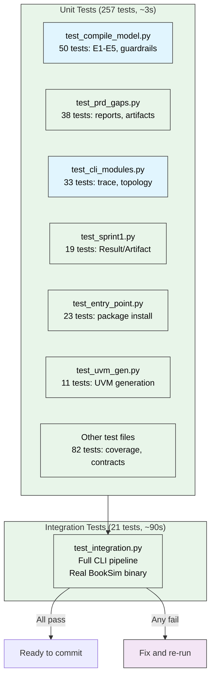

### 31.4 Test Philosophy

- **Unit tests** mock BookSim -- they test Python logic only
- **Integration tests** invoke the real BookSim binary -- they test the full pipeline
- **All tests must pass** before any commit
- **TDD** -- write tests first, then implement

---

<a name="debugging-troubleshooting"></a>
## 32. Debugging & Troubleshooting

### Quick Diagnostic Flowchart

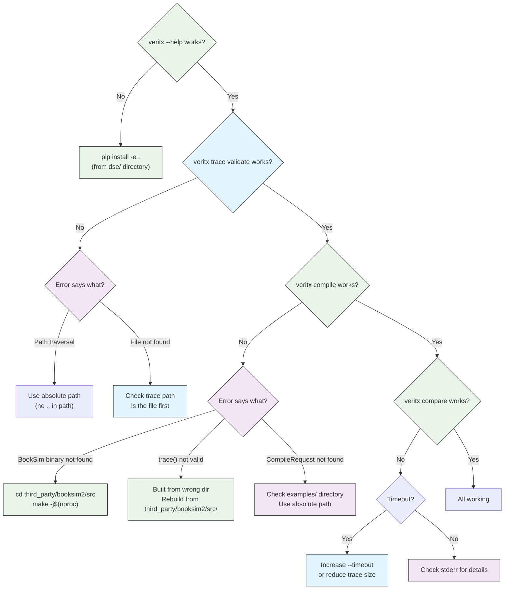

### 32.1 "BookSim binary not found"

```bash
# Build BookSim2
cd third_party/booksim2/src && make -j$(nproc)

# Verify binary exists
ls -la third_party/booksim2/src/booksim
```

### 32.2 "trace() not a valid traffic pattern"

This means BookSim wasn't built with our trace replay extension.

**Cause:** Built from `third_party/astra-sim/extern/.../src/` instead of `third_party/booksim2/src/`.

**Fix:** Always build from `third_party/booksim2/src/`.

### 32.3 Path traversal errors

VeritX blocks `..` in paths for security.

```bash
# Wrong
veritx trace validate ../../runs/traces/qwen3_serving_16rank.trace

# Right
veritx trace validate /full/path/to/runs/traces/qwen3_serving_16rank.trace
```

### 32.4 "REPO" path resolution bug

The `constants.py` file computes REPO by going 5 levels up from `veritx_dse/constants.py`.

```python
# veritx_dse/constants.py
REPO = Path(__file__).resolve().parent.parent.parent.parent.parent  # 5 levels up = repo root
```

If you move the `dse/` directory, update this path.

### 32.5 Tests pass but CLI fails

Tests mock BookSim, so they pass even if BookSim isn't built. Always run an integration test:

```bash
veritx compile examples/qwen3_moe_16npu.json
```

### 32.6 ASTRA-sim build fails

1. Sync BookSim2 first: `python3 scripts/tools.py booksim2 sync`
2. Check cmake version: `cmake --version` (need 3.22+)
3. Install yaml-cpp: `sudo apt install libyaml-cpp-dev`

### 32.7 Large trace files (>100MB)

The repo contains traces up to 440MB. If disk space is a concern:
- Small traces (<10MB): committed directly
- Large traces: consider Git LFS (`git lfs track "runs/traces/*.trace"`)

---

<a name="common-pitfalls"></a>
## 33. Common Pitfalls

### 33.1 Building BookSim from the wrong directory

**Problem:** You edited `third_party/booksim2/src/traffic.cpp` but built from `third_party/astra-sim/extern/.../src/`.

**Solution:** Always build from `third_party/booksim2/src/`. Use the sync script to copy changes to ASTRA-sim.

### 33.2 Using relative paths

**Problem:** `veritx compile examples/qwen3_moe_16npu.json` fails when run from a different directory.

**Solution:** Use absolute paths, or run from `tracks/t3-topology/dse/`.

### 33.3 Mock vs real BookSim

**Problem:** Unit tests pass but `veritx compile` fails.

**Explanation:** Tests mock BookSim. Only `test_integration.py` actually invokes the binary.

**Solution:** Run `python3 -m pytest tests/test_integration.py -v` after any BookSim changes.

### 33.4 Trace format confusion

**Problem:** `veritx compare` gives different results than expected.

**Check:** Run `veritx trace validate` first to verify the trace is well-formed.

### 33.5 /tmp is RAM-backed

**Problem:** Large builds or traces fill up /tmp (only ~7GB RAM-backed).

**Solution:** Never use /tmp for installs, venvs, or model downloads — it is tmpfs (RAM-backed). Use a scratch dir on the real disk (e.g. `<repo>/.scratch/`).

---

<a name="performance-benchmarks"></a>
## 34. Performance Benchmarks

### 34.1 BookSim Simulation Speed

| Trace | Packets | Time | Speed |
|-------|---------|------|-------|
| qwen3_serving_16rank | 95K | ~10s | 9.5K pkts/s |
| llama70b_tp64_ring | 1.29M | ~120s | 10.7K pkts/s |
| qwen3_tree | 26.19M | ~300s | 87.3K pkts/s |

### 34.2 Compile Pipeline Speed

| Preset | Stages | Total Time |
|--------|--------|------------|
| qwen3_moe_16npu | 6/6 | ~15s |
| llama1b_tp64 | 6/6 | ~10s |
| llama70b_tp64 | 6/6 | ~120s |

### 34.3 Test Suite Speed

| Test Category | Count | Time |
|---------------|-------|------|
| Unit tests | 257 | ~3s |
| Integration tests | 21 | ~90s |
| **Total** | **278** | **~95s** |

---

<a name="research-findings"></a>
## 35. Research Findings

### 35.1 Topology Comparison Results

**Qwen3 MoE (95K packets, 16 NPU):**

| Topology | Latency | vs mesh | Edges |
|----------|---------|---------|-------|
| mesh_8x8 | 1863c | baseline | 128 |
| torus_8x8 | 1891c | +1.5% | 128 |
| grpo_best | 1843c | -1.1% | 111 |
| gec_express | 1836c | -1.4% | 448 |

**Key finding:** grpo_best (111 edges) beats mesh (128 edges) by 1.1% with 17 fewer wires — wire-efficient.

### 35.2 MoE Burst Pattern

MoE traffic has characteristic bursts:
- Average IR: 0.146 pkts/cycle (sparse)
- Burst IR: 1.94 pkts/cycle (13× average)
- Topology matters most during bursts, not on average

### 35.3 Torus vs Mesh

Torus beats mesh only where path length is the binding constraint:
- Attention traffic: torus -32% vs mesh (wrap-around helps)
- MoE serving: torus +1.5% vs mesh (no benefit, extra wires wasted)

---

<a name="comparison-with-other-tools"></a>
## 36. Comparison with Other Tools

| Tool | What it does | VeritX advantage |
|------|-------------|------------------|
| BookSim2 | NoC simulator | VeritX adds trace replay, CLI, compile pipeline |
| ASTRA-sim | Multi-die simulator | VeritX adds topology DSE, verification, reporting |
| Timeloop | Energy model | VeritX integrates with Timeloop for energy estimates |
| Arteris FlexNoC | Commercial NoC IP | VeritX is open, extensible, ML-workload-focused |
| Noxim | SystemC NoC sim | VeritX uses BookSim2 (faster, more topologies) |
| SCALE-Sim | Systolic array sim | Different layer (compute vs network) |

---

<a name="hardware-requirements"></a>
## 37. Hardware Requirements

### Minimum

| Resource | Requirement |
|----------|-------------|
| CPU | 2+ cores |
| RAM | 4GB |
| Disk | 2GB free |
| Python | 3.10+ |

### Recommended

| Resource | Requirement |
|----------|-------------|
| CPU | 8+ cores (for parallel BookSim runs) |
| RAM | 16GB (for large traces) |
| Disk | 10GB free |
| GPU | Not required (BookSim is CPU-only) |

### For ASTRA-sim

| Resource | Requirement |
|----------|-------------|
| RAM | 14GB+ (ASTRA-sim is memory-hungry) |
| Disk | 5GB free |

---

<a name="environment-setup"></a>
## 38. Environment Setup

### 38.1 Fresh Install

```bash
# Clone repo
git clone https://internal-devrepo.datavex.ai/anmol/veritx-research.git
cd veritx-research

# Install VeritX
cd tracks/t3-topology/dse
pip install -e .

# Build BookSim2
cd ../../third_party/booksim2/src
make -j$(nproc)

# Verify
veritx --help
```

### 38.2 Docker (Alternative)

```bash
# Build Docker image
docker build -t veritx .

# Run
docker run -it veritx veritx --help
```

### 38.3 Python Virtual Environment

```bash
cd tracks/t3-topology/dse
python3 -m venv .venv
source .venv/bin/activate
pip install -e .
pip install pytest  # for testing
```

---

<a name="cicd-integration"></a>
## 39. CI/CD Integration

### 39.1 GitLab CI

The repo has `.gitlab-ci.yml` configured:

```yaml
stages:
  - test
  - build
  - deploy

test:
  stage: test
  script:
    - cd tracks/t3-topology/dse
    - pip install -e .
    - python3 -m pytest tests/ -v
```

### 39.2 GitHub Actions

```yaml
name: Tests
on: [push, pull_request]
jobs:
  test:
    runs-on: ubuntu-latest
    steps:
      - uses: actions/checkout@v3
      - uses: actions/setup-python@v4
        with:
          python-version: '3.10'
      - run: cd tracks/t3-topology/dse && pip install -e .
      - run: cd tracks/t3-topology/dse && python3 -m pytest tests/ -v
```

---

<a name="security-considerations"></a>
## 40. Security Considerations

### 40.1 Path Traversal

VeritX blocks `..` in paths to prevent directory traversal attacks:

```python
def _resolve_path(path: str) -> Path:
    """Resolve path and block traversal."""
    p = Path(path).resolve()
    if ".." in str(p):
        raise SecurityError(f"Path traversal not allowed: {path}")
    return p
```

### 40.2 Input Validation

All CompileRequest fields are validated:
- Required fields checked
- Type checking enforced
- Enum values validated
- Numeric ranges checked

### 40.3 Manifest Signing

Design manifests are signed with HMAC-SHA256:

```python
def sign_manifest(manifest: dict, secret: str) -> str:
    """Sign manifest with HMAC-SHA256."""
    payload = json.dumps(manifest, sort_keys=True)
    return hmac.new(secret.encode(), payload.encode(), hashlib.sha256).hexdigest()
```

### 40.4 No Arbitrary Code Execution

VeritX never evaluates user-provided code. All configurations are parsed as data, not executed.

---

<a name="api-reference"></a>
## 41. API Reference

### 41.1 Python API

```python
from veritx_dse import (
    CompileRequest,
    Workload,
    Agent,
    NocConfig,
    run_compile,
    run_compare,
    run_sweep,
)
```

### 41.2 CLI API

```bash
veritx <command> [options]
```

All commands support:
- `--json` — JSON output
- `--output <file>` — Write to file
- `--verbose` — Verbose output
- `--quiet` — Suppress output
- `--seed <int>` — Random seed
- `--log <file>` — Log to file

### 41.3 Programmatic Usage

```python
from veritx_dse.compile_model import CompileRequest, Workload, Agent

# Create a request
request = CompileRequest(
    workload=Workload(
        model_family="mixture_of_experts",
        tp=16, ep=8,
        trace_path="runs/traces/qwen3.trace"
    ),
    agents=[
        Agent(kind="compute_tile", count=16),
        Agent(kind="hbm_controller", count=4),
    ],
    requirements=[],
    dependencies=[],
    noc_config=NocConfig(topology_family="mesh"),
)

# Run compile pipeline
result = run_compile(request)
print(result["simulation"]["latency"])  # 1850.64
```

---

<a name="configuration-reference"></a>
## 42. Configuration Reference

### 42.1 Environment Variables

| Variable | Default | Description |
|----------|---------|-------------|
| `VERITX_LOG_LEVEL` | `INFO` | Logging level (DEBUG, INFO, WARNING, ERROR) |
| `VERITX_BOOKSIM_BIN` | auto | Path to BookSim binary |
| `VERITX_TIMEOUT` | `300` | Simulation timeout in seconds |
| `VERITX_SEED` | `42` | Default random seed |

### 42.2 pyproject.toml

```toml
[project]
name = "veritx-dse"
version = "0.3.0"
requires-python = ">=3.10"

[project.scripts]
veritx = "veritx_dse.cli:main"

[tool.pytest.ini_options]
testpaths = ["tests"]
```

---

<a name="glossary"></a>
## 43. Glossary

| Term | Definition |
|------|------------|
| **NoC** | Network-on-Chip — the interconnect fabric between compute tiles |
| **VC** | Virtual Channel — logical channel within a physical link |
| **MoE** | Mixture-of-Experts — sparse transformer architecture |
| **TP** | Tensor Parallelism — splitting tensors across NPUs |
| **EP** | Expert Parallelism — distributing experts across NPUs |
| **DP** | Data Parallelism — replicating model across NPUs |
| **UCIe** | Universal Chiplet Interconnect Express — die-to-die standard |
| **GEC** | Graceful Express Channel — express links for hot traffic |
| **MECS** | Multicast Express Channel — one-to-many express links |
| **FLIT** | Flow Control Unit — smallest unit of data transfer |
| **DOR** | Dimension-Order Routing — deterministic routing |
| **BO** | Bayesian Optimization — black-box optimization |
| **RHO** | Random Hill Climbing — local search algorithm |
| **GRPO** | Group Relative Policy Optimization — population-based search |
| **UVM** | Universal Verification Methodology — SystemVerilog test framework |
| **HMAC** | Hash-based Message Authentication Code — signing mechanism |

---

<a name="changelog"></a>
## 44. Changelog

### v0.3.0 (2026-08-31)
- Full compile pipeline (6 stages)
- UVM testbench generation
- Design manifest signing
- Sensitivity analysis
- Memory hierarchy correction
- 278 tests, all pass
- **LLMServingSim full-stack integration** (veritx serve)
  - Interactive protocol: Python scheduler ↔ C++ ASTRA-sim/BookSim2
  - Multi-instance round-robin serving with load/run protocol
  - PD (prefill/decode) disaggregation with transfer latency
  - MoE DP+EP parallelism simulation
  - Agentic multi-turn session support
  - In-process Chakra conversion (28× faster)
  - Decode trace cache
  - Cycle-accurate BookSim clock (int64 + fabric lock-step)
  - PD silent-drop fix (extras path prefill completion transfer)
  - Loud dropped-request guard at exit
  - SPD log → stderr (prevents pipe deadlock)
  - Exact "Waiting" match (prevents spdlog interleaving stalls)
  - Stderr capture on binary EOF
  - DSE CLI `serve` command with path resolution
- **Validated configs on booksim**: single-instance, multi-instance, PD, 4-instance PD, dual-node, MoE single/multi/DP+EP, MoE PD
- **15+ cluster configs**, 2 network backends, 7 workload datasets
- Dockerfile: AnalyticalAstra build, LLMServingSim astra-sim subtree, profiler data

### v0.2.0 (2026-08-29)
- Trace replay in BookSim2
- GEC/MECS topology support
- Pareto front analysis
- Binary trace format

### v0.1.0 (2026-08-25)
- Initial CLI
- Basic compare/sweep
- BookSim2 fork

---

<a name="roadmap"></a>
## 45. Roadmap

### Phase 1: Engine Core (P1) — ~80% complete
- [x] E1-E5 data model
- [x] Guardrail enforcement
- [x] VC derivation
- [x] BookSim2 integration
- [x] Compile pipeline (6 stages)

### Phase 2: Generate Path (P2) — ~30% complete
- [x] UVM testbench generation
- [x] Design manifest signing
- [ ] RTL generation
- [ ] Behavioral model export

### Phase 3: Views & Reports (P3) — ~0%
- [ ] Interactive topology editor
- [ ] Live latency heatmap
- [ ] Physical floorplan view

### Phase 4: Interactive Sim (P4) — ~0%
- [ ] In-browser simulator
- [ ] Tweak-and-replot
- [ ] Real-time comparison

### Phase 5: Full Editing (P5) — ~0%
- [ ] Live editing in every view
- [ ] Background re-validation
- [ ] Collaborative editing

---

<a name="known-limitations"></a>
## 46. Known Limitations

1. **No RTL generation** — VeritX produces UVM testbenches and manifests, but not synthesizable RTL
2. **No interactive UI** — CLI-only, no web interface
3. **Area/power estimates are approximate** — ±30% for area, order-of-magnitude for energy
4. **F7 QoS isolation not implemented** — pending
5. **Large traces (>100MB) slow** — BookSim processes them sequentially
6. **No GPU acceleration** — BookSim is CPU-only
7. **Multi-die requires ASTRA-sim** — built into the container but requires separate compilation outside
8. **No thermal modeling** — power estimates don't include thermal effects
9. **Serving simulation is serial** — N instances cost N× wall time (one round per instance)
10. **Replay-only mode is default** — true cycle-accurate mode requires matching ASTRA ring = BookSim mesh topology
11. **Synthetic H100 profiles** — perf_db scaled from RTX Pro 6000 data, not real H100 measurements
12. **Analytical backend is 1D-only** — no multi-dimension fabric support (Helper.cpp:27)
13. **Dual-node configs with EP/KV-remote crash** — ASTRA-sim assertion failure in GeneralComplexTopology
14. **PIM/CXL/power configs untested** — code paths exist but not validated on current build
15. **Full SWE-bench trace very slow** — 765 sub-requests on booksim could take hours
16. **tp4/tp8 profiles missing** — profiler only has tp1/tp2 data for RTX Pro 6000

---

<a name="faq"></a>
## 47. FAQ

### Q: How accurate are the latency numbers?
**A:** BookSim latency is cycle-accurate and deterministic. For the same trace and topology, you get the same result every time.

### Q: Can I use VeritX for non-AI workloads?
**A:** Yes. VeritX is workload-agnostic — it simulates any traffic trace. The presets are AI-focused, but you can create custom traces for HPC, automotive, or any other domain.

### Q: How do I add a new topology that's not in BookSim?
**A:** Use `anynet` format. Create a `.anynet` file describing your topology graph, then use `--anynet my_topology.anynet` in compare/sweep.

### Q: Why are my test results different from the README?
**A:** BookSim is deterministic, but different seeds produce different results. Use `--seeds 3` for statistical confidence, or `--seed 42` for reproducibility.

### Q: Can I run this on Windows?
**A:** Not directly. VeritX uses Linux-specific paths. Use WSL2 or a Docker container.

### Q: How do I generate traces from my own model?
**A:** Use LLMServingSim (see [Section 12](#12-llmservingsim-traffic-generation)) or write a trace generator that outputs the ASCII format (see [Section 6.1](#61-trace-format)).

---

<a name="license"></a>
## 48. License

Proprietary — VeritX Research Team

---

<a name="contributing"></a>
## 49. Contributing

### 49.1 Development Workflow

1. Write tests first (`tests/test_my_feature.py`)
2. Implement in `veritx_dse/my_module.py`
3. Wire into `cli.py` command handler
4. Run `python3 -m pytest tests/ -v` — all 278 must pass
5. Update this README if adding public API
6. If editing BookSim2, run `python3 scripts/tools.py booksim2 sync`

### 49.2 Code Style

- Type hints on all public functions
- Docstrings on all public classes
- No globals (use `Ctx` dataclass)
- No `sys.exit()` in commands
- Tests for all new functionality

### 49.3 Pull Request Checklist

- [ ] All 278 tests pass
- [ ] New functionality has tests
- [ ] README updated if public API changed
- [ ] BookSim changes synced to ASTRA-sim
- [ ] No hardcoded paths
- [ ] No new globals

---

<a name="references"></a>
## 50. References

1. **BookSim2** — Jiang et al., "A Detailed and Flexible Cycle-Accurate Network-on-Chip Simulator," ISPASS 2013
2. **ASTRA-sim** — Mallappa et al., "Astra-sim: Enabling Co-design of Network-on-Chip and Collective Algorithms for DNN Training," ISPASS 2024
3. **LLMServingSim** — Cho et al., "LLMServingSim 2.0: A Unified Simulator for Heterogeneous and Disaggregated LLM Serving Infrastructure," ISPASS 2026
4. **Timeloop** — Shao et al., "Timeloop: A Systematic Approach to DNN Accelerator Evaluation," ISPASS 2017
5. **GEC/MECS** — SrotaSemi internal research (2026)

---

<a name="support"></a>
## 51. Support

- **Issues:** https://internal-devrepo.datavex.ai/anmol/veritx-research/-/issues
- **Docs:** This README + `docs/` directory
- **Examples:** `examples/` directory

---

*Last updated: 2026-08-31*
